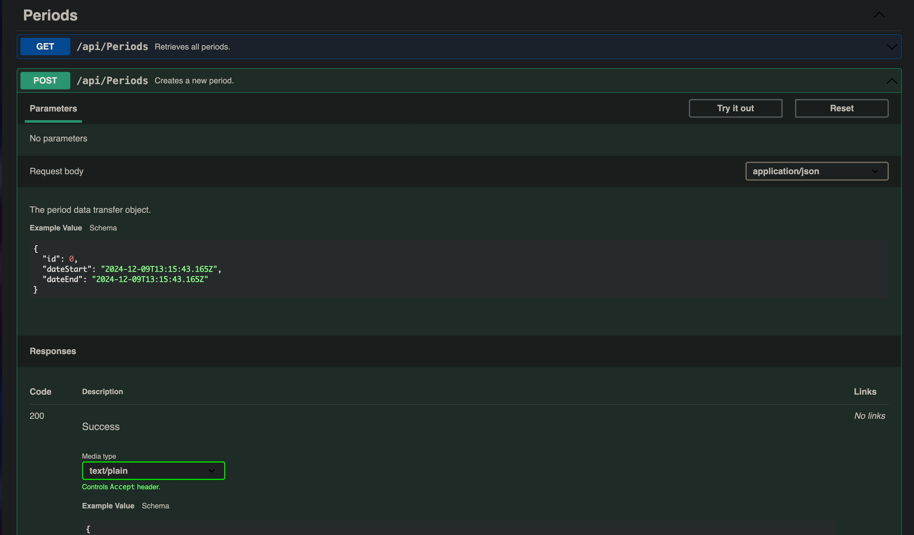
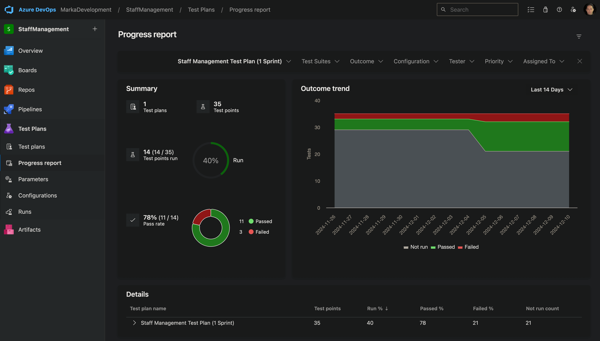
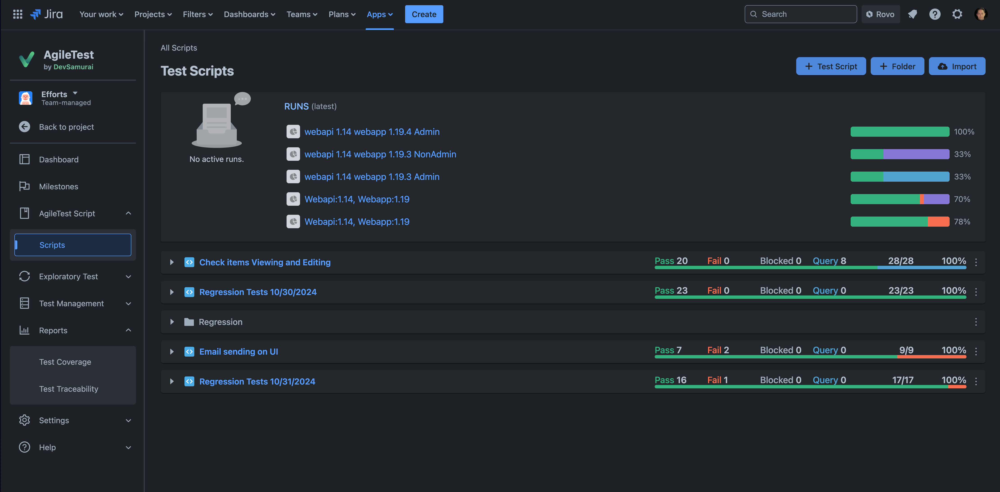

**Table of Contents**

- [Introduction](#introduction)
- [Process Standards and Recommendations](#process-standards-and-recommendations)
  - [Human Resources (HR)](#human-resources-hr)
    - [Tools](#tools)
    - [Onboarding](#onboarding)
    - [Qualification Monitoring and Training](#qualification-monitoring-and-training)
      - [Monitoring and Skill Assessment](#monitoring-and-skill-assessment)
      - [Skill Score Requirements](#skill-score-requirements)
      - [Viewing Skills](#viewing-skills)
      - [Conducting Skill Checks and Interviews](#conducting-skill-checks-and-interviews)
      - [Viewing Interview Results](#viewing-interview-results)
  - [Project Management and Collaboration](#project-management-and-collaboration)
    - [Communication and Process Workflows](#communication-and-process-workflows)
    - [Project Management Tools and Resources](#project-management-tools-and-resources)
    - [Default Project Model and Team Activities](#default-project-model-and-team-activities)
  - [Development](#development)
    - [Version Control and Branching](#version-control-and-branching)
    - [Code Style and Formatting](#code-style-and-formatting)
      - [IDE/Editor Configuration](#ideeditor-configuration)
      - [Linters and Formatters](#linters-and-formatters)
      - [Commit Message Validation](#commit-message-validation)
      - [Commit Message Standards](#commit-message-standards)
    - [Web API Development Conventions](#web-api-development-conventions)
      - [REST Compliance](#rest-compliance)
      - [REST Methods](#rest-methods)
      - [Resource Structures](#resource-structures)
    - [Observability](#observability)
      - [Low-scale solutions (demo, training, etc. projects)](#low-scale-solutions-demo-training-etc-projects)
      - [High-scale solutions for production](#high-scale-solutions-for-production)
        - [Logs](#logs)
          - [Semantic Conventions](#semantic-conventions)
          - [Best Practices to follow](#best-practices-to-follow)
        - [Metrics](#metrics)
          - [Required Metrics](#required-metrics)
          - [Metric Types](#metric-types)
        - [Distributed Tracing](#distributed-tracing)
          - [Trace Requirements](#trace-requirements)
          - [Sampling Strategy](#sampling-strategy)
    - [Containerization](#containerization)
      - [Dockerfile and Docker Compose Requirements](#dockerfile-and-docker-compose-requirements)
      - [General Recommendations](#general-recommendations)
    - [Optimizations](#optimizations)
  - [Documentation](#documentation)
    - [Web API, Serverless, and Data Contracts](#web-api-serverless-and-data-contracts)
    - [Release Changelogs](#release-changelogs)
    - [Test Reports](#test-reports)
      - [Recommended Tools:](#recommended-tools)
  - [Testing](#testing)
    - [Test Types](#test-types)
    - [Additional Notes](#additional-notes)
    - [Resources](#resources)
  - [Deployment](#deployment)
    - [Cloud Providers](#cloud-providers)
      - [Azure](#azure)
      - [Azure Resources Naming Conventions](#azure-resources-naming-conventions)
    - [DevOps Practices](#devops-practices)
      - [Deployment Types](#deployment-types)
      - [Infrastructure as Code (IaC)](#infrastructure-as-code-iac)
  - [Security](#security)
    - [Backup Policy](#backup-policy)
      - [Key Principles](#key-principles)
      - [Backup Locations and Security](#backup-locations-and-security)
      - [Monitoring and Notifications](#monitoring-and-notifications)
      - [Policy Guidelines](#policy-guidelines)
      - [Recommended Tools](#recommended-tools-1)
    - [External Access](#external-access)
      - [Access to Internal Resources](#access-to-internal-resources)
      - [Secure Database Access](#secure-database-access)
      - [Web Application Protection](#web-application-protection)
      - [Authentication and Authorization](#authentication-and-authorization)
      - [Monitoring and Auditing](#monitoring-and-auditing)
    - [Vulnerability and Dependency Management](#vulnerability-and-dependency-management)
- [Official Resources](#official-resources)

---

# Introduction

This document presents Marka’s official processes, standards, and best practices. It ensures that all teams operate with consistency, quality, and efficiency, while maintaining alignment with organizational goals. Use this guide as a reference for standard operating procedures, technical conventions, and recommended workflows across all projects and departments within Marka.

---

# Process Standards and Recommendations

## Human Resources (HR)

### Tools

Marka employs a custom “Staff Management” solution for handling HR-related processes, including candidate management, employee skill assessments, and professional development tracking. This system streamlines HR operations, improving efficiency and automation.


**Access:** [Staff Management System](https://wa-staffmanagement-linux-prod.azurewebsites.net)  
Obtain credentials from Marka’s CTO.

### Onboarding

When onboarding a new employee, the following steps must be taken:

- Create an Entra ID (Azure AD) account in the `marka-software.company` domain.
- Set up a Staff Management System account.
- Create a Kimai time-tracking account (with project and customer configuration if required).
- Conduct an introductory call and provide all necessary credentials and accesses.

Post-onboarding, essential information (contacts, benefits, process standards, tools, licenses) is available under the user’s personal tab in the Staff Management System.

### Qualification Monitoring and Training

The Staff Management System automatically tracks both required and current qualifications for each employee, ensuring alignment with professional standards. Regular Personal Development Plans (PDPs) and feedback sessions facilitate continuous growth and relevance in the market.

#### Monitoring and Skill Assessment

- **Interns and Juniors**: Skill checks to be conducted in Staff Management System every two weeks.
- **Other Roles**: Assessment schedules are determined individually.

The system calculates a **skill score** for each employee, divided into two categories:

1. **Mandatory Qualifications**: Required for the employee's position.
2. **Optional Qualifications**: Additional skills that enhance the employee’s role.

Skill scores are derived from the number of skills linked to the employee via completed tasks or automatic skill checks (internal interviews). Current scores are displayed on the employee's personal page in the Staff Management System.


#### Skill Score Requirements

- **Mandatory Qualifications**: A minimum score of **70%** is required for qualification.
- **Optional Qualifications**: A minimum score of **50%** is required for qualification.

#### Viewing Skills

To review linked skills:

1. Open the `Skillmatching` tab on the employee's personal page.
2. Toggle to `Matched` to view skills already obtained and proved.


Skills that still need to be acquired appear under the `Mismatched` toggle.


#### Conducting Skill Checks and Interviews

To initiate a new skill check or interview:

1. Navigate to `Interview -> New Interview`.
2. Click **Check My Skills**.
3. Select a position for skill assessment.
4. Complete the proposed questions and submit the results.

For targeted skill improvement, employees can add a specific topic under the selected position before starting the interview.


#### Viewing Interview Results

Results from completed interviews can be accessed under `Interview -> History` in the Staff Management System.

---

## Project Management and Collaboration

### Communication and Process Workflows

For internal and managed projects, all corporate communication should occur via Marka’s self-hosted Mattermost solution.


For critical project workflows, configure and use automated playbooks within Mattermost, such as those for incident resolution:


### Project Management Tools and Resources

Azure DevOps Projects is the default choice for project management. Jira and Confluence may be used as secondary or training platforms. Marka’s Azure and Atlassian subscriptions must be used exclusively for company projects and staff skill development.

### Default Project Model and Team Activities

The standard project methodology is Scrum with two-week sprints.  
Daily stand-ups (at least twice a week), sprint planning, and sprint reviews are recommended. Sprint reviews can be conducted on demand.


---

## Development

### Version Control and Branching

Use Git for all projects, with Azure DevOps Repos or GitHub for repository hosting.  
For large projects, adopt the Git Flow model. For smaller projects, a simplified branching strategy may be used:

- **main:** fully tested, production-ready code
- **dev:** active development branch
- **feature:** optional feature branches for major changes
- **bugfix:** optional bugfix branches

Tag releases in `main` with version numbers. For small/training projects, `main` and `dev` branches may suffice.

Git branches naming convention:

- Use lowercase letters and hyphens to separate words (kebab-case)
- Include a category prefix like feature/, bugfix/, hotfix/, or docs/
- Keep names descriptive but concise
- Incorporate issue or ticket numbers when applicable
- Avoid using only numbers
- Use clear, meaningful names that explain the branch's purpose

Examples:

- feature/add-user-authentication
- bugfix/login-page-error
- hotfix/security-vulnerability-123

In projects with extreme level of collaboration, it is acceptable to put developer initials in the branch name.
Typical format in this case: [category]/[initials]-[description]

Examples:

- feature/jd-user-login
- bugfix/mp-database-connection

### Code Style and Formatting

Maintain high-quality, consistent, and maintainable code by establishing corporate code standards and enforcing them via automated git hooks or dedicated tasks in CI/CD pipelines.

#### IDE/Editor Configuration

Use `.editorconfig` (https://github.com/editorconfig) or other standardized configuration files for consistent formatting and styling.
Find pre-configured `.editorconfig` files for C#, JavaScript and Python in the repository (https://github.com/Nakishev/MarkaStandards/tree/main/Configs/Editor).

#### Linters and Formatters

Employ linters and formatters to enforce code style rules automatically.
For C# projects, use `Roslyn` custom rules configured in the `.editorconfig` file and enforce 'treat warnings as errors' option.
To apply code style rules automatically, use `CSharpier`.
In JavaScript projects, use `Binome` as both linter and formatter.

#### Commit Message Validation

Use Husky and lint-staged with conventional commit rules to ensure commit messages meet corporate standards.

#### Commit Message Standards

Commit messages should be clear and descriptive, including:

- Change type (feat, fix, refactor, etc.)
- Brief summary
- Task/issue number
- Optional detailed lists of changes and rationale

**Example:**

```
feat: Enhance portfolio period aggregation #1287

Extended IPortfolioService and PortfolioService for optional filtering of portfolio period histories.
Modified PortfolioController to accept a currentPeriodOnly query parameter.
Improved UpdateCurrentPrices logic for recalculation after price updates.
These enhancements increase flexibility and usability of the portfolio period aggregation feature.
```

---

### Web API Development Conventions

#### REST Compliance

Adhere to REST principles (Level 0–2 of Richardson Maturity Model). Level 3 (Hypermedia) is optional.

#### REST Methods

Below is a list of methods that Marka REST services SHOULD support. Not all resources will support all methods, but all resources using the methods below MUST conform to their usage.

| Method | Description                                                         | Is Idempotent |
| ------ | ------------------------------------------------------------------- | ------------- |
| GET    | Return the current value of an object                               | True          |
| PUT    | Replace an object, or create a named object, when applicable        | True          |
| DELETE | Delete an object                                                    | True          |
| POST   | Create a new object based on the data provided, or submit a command | False         |
| PATCH  | Apply a partial update to an object                                 | False         |

#### Resource Structures

Use nouns, logical URI patterns, and query parameters for filtering/sorting. Avoid verbs in URIs and rely on HTTP methods to represent actions.

**Examples:**

```
GET /device-management/managed-devices // Retrieve all devices POST /device-management/managed-devices // Create a new device GET /device-management/managed-devices/{id} // Retrieve a single device
```

**Use hyphens (-) to improve the readability of URIs**
To make your URIs easy for people to scan and interpret, use the hyphen (-) character to improve the readability of names in long-path segments.

```
http://api.example.com/api/managed-devices /*correct*/
http://api.example.com/api/manageddevices/ /*incorrect*/
```

**Use lowercase letters in URIs**
When convenient, lowercase letters should be consistently preferred in URI paths.

```
http://api.example.org/api/my-folders/my-doc  /*correct*/
HTTP://API.EXAMPLE.ORG/api/my-folders/my-doc  /*incorrect*/
http://api.example.org/api/My-Folders/my-doc  /*incorrect*/
```

**Use imperative style for endpoint summaries.**
There are two styles of summaries: imperative (e.g. "Create an item") and declarative (e.g. "Creates an item").

"Create an item" (Preferred)

- Imperative style: Reads like a command or instruction to the client.
- Commonly used in documentation as it describes the action the endpoint performs.
- Consistent with how other API specifications (e.g., OpenAPI, REST APIs) are typically written.
- Matches the usual tense of HTTP verbs (e.g., POST, GET):

```
POST /api/items – "Create an item"
GET /api/items – "Get a list of items"
```

Example in OpenAPI specification:

```
"paths": {
  "/items": {
    "post": {
      "summary": "Create an item",
      "description": "Creates a new item in the inventory."
    }
  }
}

```

**Versioning**
Use semantic versioning for APIs and increment versions upon breaking changes.

---

### Observability

#### Low-scale solutions (demo, training, etc. projects)

Use Azure AppInsights as the primary monitoring tool for low-scale projects.
Use standard severity levels (INFO, WARN, ERROR) for logging and alerting.
Attribute every log message with the prefix within squared brackets containing:

- Solution name
- Project/Service name
- Method name
- "logs" or "alerts"

Example:

```
[InterviewService.QuestionService.GenerateQuestions.Logs] Stared generating questions for interview

```

#### High-scale solutions for production

##### Logs

Use OpenTelemetry compatible logging tools (OpenTelemetry/Azure AppInsights). Prefer standard OpenTelemetry Protocol (OTLP) exporters exporters for maximum compatibility and standardization.

###### Semantic Conventions

Stick to the OpenTelemetry's Logs Data Model ([Logs Data Model](https://opentelemetry.io/docs/specs/otel/logs/data-model/)) when developing log properties and formats.

Preferred list of log attributes:

- `ServiceName`: Name of the service generating the log
- `Timestamp`: Time when the event occurred (UTC)
- `ObservedTimestamp`: Time when the event was observed by the logging system (UTC)
- `SeverityText`: Text representation of severity level (TRACE, DEBUG, INFO, WARN, ERROR, FATAL)
- `SeverityNumber`: Numeric representation of severity (1-24 as per OTel spec)
- `Body`: The primary message content
- `Resource`: Information about the entity producing the log (service, k8s pod, etc.)
- `Attributes`: Additional contextual information as key-value pairs
- `TraceId`: Unique identifier for the trace (for distributed tracing)
- `SpanId`: Unique identifier for the span within the trace
- `TraceFlags`: Trace option flags (e.g., sampling decision)

###### Best Practices to follow

1. Structured Logging

   - Always use structured logging format (JSON)
   - Avoid free-form text in attributes
   - Use semantic conventions for attribute naming

2. Context Propagation

   - Always propagate trace context
   - Include correlation IDs
   - Maintain baggage items where relevant

3. Sampling

   - Implement appropriate sampling strategies
   - Consider head-based sampling for services
   - Use tail-based sampling for error cases

4. Performance
   - Use batching for log exports
   - Implement appropriate buffer sizes
   - Handle backpressure properly

##### Metrics

Implement standard OpenTelemetry metrics for consistent monitoring across services.

###### Required Metrics

1. Service Health

   - Uptime
   - Memory usage
   - CPU usage
   - Active connections

2. Business Metrics
   - Request rates
   - Error rates
   - Response times
   - Business-specific KPIs

###### Metric Types

Use appropriate OpenTelemetry metric instruments:

1. Counter

   - For values that only increase
   - Example: request_count, error_count

2. Gauge

   - For values that can go up and down
   - Example: memory_usage, active_connections

3. Histogram
   - For distributions of values
   - Example: request_duration, payload_size

##### Distributed Tracing

Implement distributed tracing using OpenTelemetry trace semantics.

###### Trace Requirements

1. Span Naming

   - Use clear, descriptive names
   - Follow the format: `<operation_name>.<context>`
   - Example: `payment.process`, `auth.validate`

2. Required Span Attributes

   - `service.name`
   - `service.version`
   - `deployment.environment`
   - HTTP attributes for web requests
   - Database attributes for queries

3. Error Handling
   - Always mark failed spans with error status
   - Include error details in span attributes
   - Link related logs to spans

###### Sampling Strategy

1. Production Environment

   - Use tail-based sampling
   - Sample 100% of error spans
   - Sample 10% of normal traffic

2. Non-Production Environments
   - Sample 100% of all spans
   - Enable debug spans when needed

---

### Containerization

All developed projects and infrastructure components must be containerized (if it is technically possible) to ensure portability, scalability, and compatibility across various deployment environments (even if the project is not yet supposed to be deployed or used as containerized application). The containerized solutions should meet the following requirements:

- Flexibility in Deployment:
  - Must be capable of running as a standalone container or as part of a Docker Compose stack.
  - Ready for deployment to any cloud provider as a containerized application.
  - Fully compatible with Kubernetes clusters for seamless orchestration and scaling.
- Support for Integration Testing:
  - Must be usable in automated testing frameworks, such as Testcontainers, to enable robust and consistent integration testing.
- Standardized Tooling:
  - Docker must be used as the primary tool for containerization to maintain consistency and alignment with industry standards.

Docker must be used as the primary tool for containerization to maintain consistency and alignment with industry standards.

#### Dockerfile and Docker Compose Requirements

1. Dockerfile

- Every project must include a Dockerfile located in the root directory of the project.
- The Dockerfile should be:

  - Functional: Able to build and run the containerized application without errors.
  - Efficient: Optimized for performance and image size.
  - Up-to-date: Regularly maintained to reflect the current state of the project.

2. Docker Compose File

- The solution must include a default docker-compose.yml file located in the root directory of the solution.
- The docker-compose.yml file should:
  - Define all the necessary services, networks, and volumes required to run the solution in a containerized environment.
  - Be actual and functional, ensuring all services can be started and interact correctly.
  - Support local development and testing scenarios by including configurations for required dependencies (e.g., databases, message brokers).

#### General Recommendations

- **Use Multi-Stage Builds**  
  Optimize the build process by separating build and runtime stages to reduce the final image size.

- **Prefer Alpine-Based Images**  
  Utilize lightweight Alpine-based images wherever possible to ensure smaller and more secure containers.

- **Minimize Image Size and Layer Count**

  - Combine related `RUN` instructions to reduce the number of layers (use `&&` operator).
  - Remove unnecessary files and dependencies to keep the image lean.

- **Use `.dockerignore`**  
  Exclude unnecessary files (e.g., build artifacts, local configurations) from being copied into the image.

### Optimizations

Leverage tools to analyze and optimize Docker images:

- **[Dive](https://github.com/wagoodman/dive)**  
  A tool for exploring and analyzing Docker images to improve image efficiency and layer usage.

- **[Slim](https://github.com/slimtoolkit/slim?tab=readme-ov-file)**  
  A tool for automatically slimming down Docker images by identifying and removing unnecessary parts.

By following these guidelines, teams can ensure that Docker images are efficient, secure, and optimized for performance.

---

## Documentation

Consistently maintain all standard project documentation, including API specifications, serverless definitions, data contracts, release notes, and test reports. Documentation should be automatically generated where possible to ensure accuracy and ease of updates.

### Web API, Serverless, and Data Contracts

Document all Web APIs, serverless functions, and data contracts using robust tools. These tools ensure clarity and provide a consistent interface for developers and stakeholders.

- **Preferred Tool**: **Scalar** for its enhanced documentation capabilities and advanced features.
- **Alternative Tool**: **SwaggerUI** for basic API documentation needs.

**SwaggerUI Example**:


**Scalar Example**:


### Release Changelogs

Automate the generation of release changelogs using standardized commit messages. This ensures a clear and concise history of changes for each release.

- **Best Practice**: Use tools or custom scripts to parse commit messages formatted in a conventional style (e.g., [Conventional Commits](https://www.conventionalcommits.org/)) to generate changelogs automatically.

**Example Changelog**:
Generated using a custom script based on commit messages.


### Test Reports

Share with stakeholders and customers comprehensive release test reports, that are automatically generated using tools integrated with your DevOps pipeline or based on test runs/executions according to the project test plans and created issues/bugs.
These reports provide a detailed view of test results and coverage (if applicable and required) for every release.

#### Recommended Tools:

- **Azure DevOps**: Use built-in test plugins to automatically generate detailed test reports from test executions.
- **Jira**: Leverage Jira test management plugins to integrate with test runs and create comprehensive reports.

**Azure DevOps Test Reports Example**:


**Jira Test Reports Examples**:



---

## Testing

Adopt a comprehensive, automated testing strategy, including unit, integration, and end-to-end tests, as appropriate for each project. Automation enhances reliability, consistency, and speed across the development lifecycle.

### Test Types

| Test Type                  | Description                                                                                       | Recommended Tools                                     | Requirement                      |
| -------------------------- | ------------------------------------------------------------------------------------------------- | ----------------------------------------------------- | -------------------------------- |
| **Unit Tests**             | Validate individual units of code in isolation. TDD is recommended for better code quality.       | XUnit (C#), Jest/Vitest + Testing Library (JS)        | Mandatory for all projects       |
| **UI Tests**               | Test the graphical user interface of an application.                                              | Playwright                                            | Optional                         |
| **Integration Tests**      | Ensure that components or services work together as expected.                                     | Testcontainers (C#), Testcontainers + Playwright (JS) | Optional                         |
| **End-to-End Tests**       | Validate complete workflows from start to finish.                                                 | Playwright                                            | Optional                         |
| **Performance/Load Tests** | Assess the system's behavior under various conditions, including heavy load and stress scenarios. | gatling, k6, wrk, locust                              | Optional                         |
| **Acceptance Tests**       | Verify the system meets external stakeholders' requirements and specifications.                   | Playwright, or tool appropriate to project scope      | Optional (for external projects) |

### Additional Notes

- **Unit Tests**: Adopting Test-Driven Development (TDD) ensures higher quality and maintainability, so stick to whenever it's possible.
- **Performance Testing**: Tools like [Gatling](https://gatling.io/) and k6 provide actionable insights into bottlenecks.
- **End-to-End Testing**: Utilize Playwright for comprehensive coverage across browsers and devices.

### Resources

- [XUnit Documentation](https://xunit.net/)
- [Playwright Testing](https://playwright.dev/)
- [Gatling Load Testing](https://gatling.io/)
- [Testcontainers for JavaScript](https://github.com/testcontainers/testcontainers-js)

---

## Deployment

### Cloud Providers

- **Azure**  
  Azure is the primary and preferred cloud platform, leveraging its robust capabilities and Marka's Microsoft Partner status for seamless integration and support.

- **AWS and GCP**  
  These platforms may be utilized for:
  - Expanding team skill sets in multi-cloud environments.
  - Addressing specific project requirements where Azure may not be the optimal solution.

By prioritizing Azure while remaining open to AWS and GCP, the team ensures adaptability and expertise across multiple cloud platforms.

---

#### Azure

#### Azure Resources Naming Conventions

---

### DevOps Practices

#### Deployment Types

- **Manual Deployment**  
  Manual deployment is used for training and short-term projects.

- **Deployment as a docker-compose stack**  
  Deployment as a docker-compose stack to a Marka-managed Portainer instance is used for archived projects, or projects with low activity. In this case, deployments can be made manually or automatically (using a connected repository webhook or a scheduled task).

- **CI/CD Pipelines**
  Azure DevOps is used as the primary CI/CD platform, with GitHub Actions as a secondary option.
  The pipeline should be configured to deploy the project to Azure App Service or Azure Container App (preferred), and trigger on a push to the `main` branch (production) or `dev` branch (staging).

#### Infrastructure as Code (IaC)

Use Pulumi, Terraform or Azure Resource Manager (ARM) templates to provision and manage infrastructure resources as code for long-term projects.

---

## Security

### Backup Policy

Implement and enforce a comprehensive backup policy to safeguard data integrity and availability. Regularly scheduled backups, combined with routine restoration testing, ensure that critical resources can be recovered swiftly and reliably in the event of a disaster.

#### Key Principles

- **Regular Backups**: Back up all critical cloud resources such as databases, storage accounts, and repositories. Follow the project-specific backup policy, including frequency and retention periods.
- **Restoration Testing**: Periodically test the restoration process to verify the integrity and usability of backups. Include restoration drills in the DevOps cycle to simulate disaster recovery scenarios.
- **Infrastructure as Code (IaC)**: Use IaC tools such as Pulumi, Terraform, or ARM templates for fast and reliable provisioning of infrastructure. Ensure the IaC scripts are version-controlled and up-to-date.
- **3-2-1 Backup Rule**:
  - Maintain **3 copies** of your data (1 primary and 2 backups).
  - Store backups on **2 different types** of media (e.g., cloud and local storage).
  - Keep **1 copy** off-site for disaster recovery.

#### Backup Locations and Security

- **Cloud Backups**: Use Azure Backup, AWS Backup, or GCP Backup to store data securely and leverage automated backup management tools.
- **Local and Off-Site Backups**: For hybrid setups, ensure one copy of the backup is stored locally and another in a geographically distributed location.
- **Secure Storage**: Protect backups with encryption in transit and at rest. Use role-based access control (RBAC) to limit access to backup storage locations.

#### Monitoring and Notifications

- **Backup Monitoring**: Implement monitoring for backup success and failure notifications using tools like Azure Monitor, AWS CloudWatch, or custom logging solutions.
- **Alerts**: Set up automated alerts for backup failures or irregularities in the backup schedule to ensure immediate action.

#### Policy Guidelines

- **Backup Frequency**: Define a clear schedule for daily, weekly, or monthly backups based on the criticality of the resource.
- **Retention Period**: Determine retention policies for short-term and long-term backups in alignment with legal and business requirements.
- **Backup Scope**: Identify the scope of backups, including databases, file storage, application configurations, and containerized workloads.

#### Recommended Tools

- **Azure**: [Azure Backup](https://azure.microsoft.com/en-us/products/backup/), Azure Site Recovery for disaster recovery.
- **AWS**: [AWS Backup](https://aws.amazon.com/backup/), S3 lifecycle policies.
- **GCP**: [Google Cloud Backup and DR](https://cloud.google.com/backup-and-dr), Persistent Disk snapshots.
- **On-Premise**: Tools like Veeam, Bacula, or rsync for local and hybrid backup solutions.

By adhering to these guidelines, projects will achieve robust data protection, ensure high availability, and align with organizational and regulatory requirements for disaster recovery.

### External Access

Ensure secure and controlled external access to Marka's internal resources by following these best practices and guidelines.

#### Access to Internal Resources

- **VPN Access**: Use the provided OpenVPN profiles and certificates to securely access Marka's internal resources. Regularly update profiles and revoke access for inactive users to maintain security.
- **Endpoint Restrictions**: Limit external access to only the endpoints essential for functionality. Ensure these endpoints are well-documented and monitored.

#### Secure Database Access

- **Private Network Integration**:
  - Use **Azure Private Link** or **Azure Virtual Network (VNet)** to restrict access to databases containing sensitive information. This ensures that traffic flows securely within the internal network.
  - Avoid exposing databases directly to the internet.
- **Firewall Configuration**:
  - Configure firewalls to restrict database access.
  - Whitelist only specific external IP addresses of trusted users or systems that require database access.
  - Regularly review and update firewall rules to remove obsolete or unnecessary entries.

#### Web Application Protection

- **Azure Web Application Firewall (WAF)**:
  - Deploy Azure WAF to protect web applications from common vulnerabilities such as SQL injection, cross-site scripting (XSS), and DDoS attacks.
  - Regularly update WAF rules and monitor traffic to identify potential threats.
- **HTTPS Enforcement**:
  - Use HTTPS to encrypt all web traffic.
  - Implement SSL/TLS certificates and renew them automatically using tools like Let's Encrypt or Azure Key Vault.

#### Authentication and Authorization

- **Secure Authentication**:
  - Enforce strong, multi-factor authentication (MFA) for accessing sensitive resources.
  - Integrate with identity providers such as Azure Active Directory for centralized user management.
- **Granular Authorization**:
  - Follow the principle of least privilege (PoLP) by granting users only the minimum permissions needed for their roles.
  - Use role-based access control (RBAC) to manage and audit user permissions effectively.

#### Monitoring and Auditing

- **Logging and Alerts**:
  - Enable logging for VPN connections, database access, and web application traffic.
  - Set up automated alerts for unauthorized access attempts or anomalies.
- **Regular Audits**:
  - Conduct periodic audits of external access points, firewall rules, and access logs.
  - Document findings and resolve any identified risks promptly.

By implementing these measures, you can ensure robust security for Marka's internal resources while enabling controlled external access where necessary.

### Vulnerability and Dependency Management

Regularly scan for vulnerabilities in libraries and packages. Promptly address discovered issues to maintain security and stability.

---

# Official Resources

- [Official Public Site](https://marka-development.com/)
- [Staff Management System](https://wa-staffmanagement-linux-prod.azurewebsites.net)
- [Marka’s Process Standards (GitHub)](https://github.com/Nakishev/MarkaStandards)
