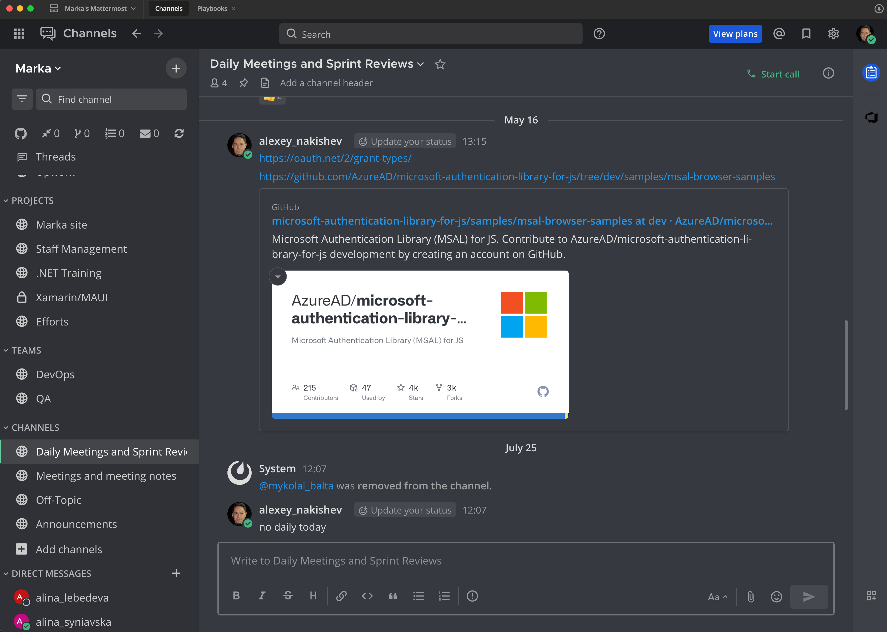
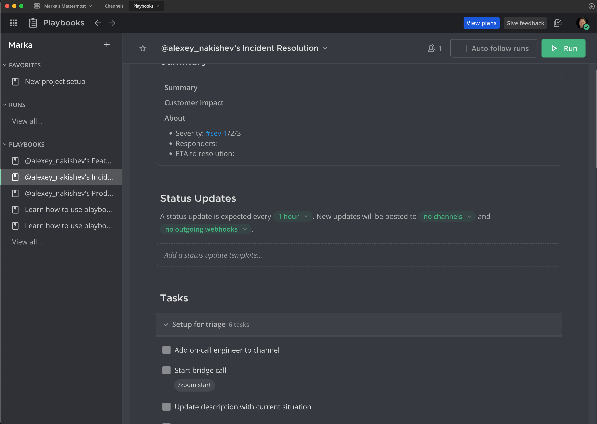
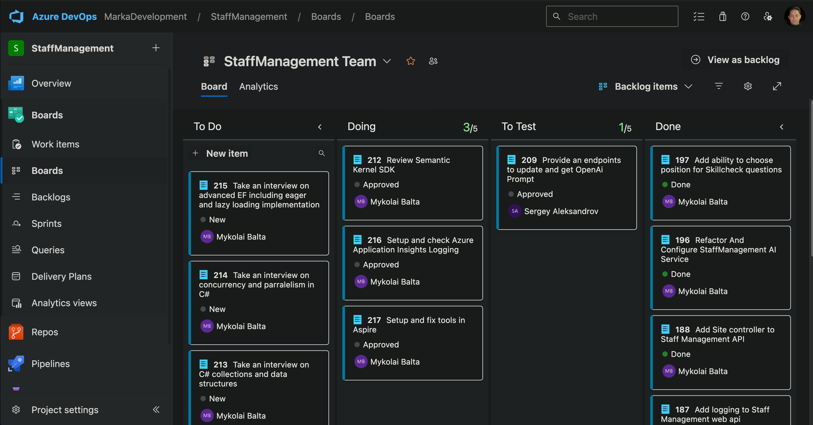

- [Introduction](#introduction)
- [Process Standards and Recommendations](#process-standards-and-recommendations)
  - [Human Resources (HR)](#human-resources-hr)
    - [Tools](#tools)
    - [Onboarding](#onboarding)
    - [Qualification Monitoring and Trainings](#qualification-monitoring-and-trainings)
  - [Project Management and Collaboration](#project-management-and-collaboration)
    - [Communication and Process Workflows](#communication-and-process-workflows)
    - [Project Management Tools and Resources](#project-management-tools-and-resources)
    - [Default Project Type and Team Activities](#default-project-type-and-team-activities)
  - [Development](#development)
    - [Version control and branching](#version-control-and-branching)
    - [Commit messages format](#commit-messages-format)
    - [Code Style and Format](#code-style-and-format)
      - [WebApi Development Conventions](#webapi-development-conventions)
        - [REST Compliance](#rest-compliance)
        - [Resources](#resources)
      - [Configuring IDE/Editors](#configuring-ideeditors)
      - [Using Linters and Code Formatters](#using-linters-and-code-formatters)
      - [Controlling commit messages format](#controlling-commit-messages-format)
  - [Documentation](#documentation)
    - [WebApi, Serverless and Data Contracts](#webapi-serverless-and-data-contracts)
    - [Docker](#docker)
      - [General Recommendations](#general-recommendations)
      - [Optimizations](#optimizations)
    - [Release changelogs](#release-changelogs)
  - [Testing](#testing)
  - [Deployment](#deployment)
    - [Cloud Providers](#cloud-providers)
  - [Security](#security)
    - [Backup Policy](#backup-policy)
    - [External Access](#external-access)
    - [Vulnerabilities and Package/Library Management](#vulnerabilities-and-packagelibrary-management)
- [Official Resources](#official-resources)

# Introduction

This document outlines the processes, procedures, recommendations and standards that define Marka’s approach to operations, ensuring consistency, quality, and efficiency. It serves as a comprehensive guide for aligning team practices with organizational goals and maintaining excellence across all projects.

# Process Standards and Recommendations

## Human Resources (HR)

### Tools

For managing projects and candidates/employees, skill assessments, progress tracking, automating personal development a custom solution Staff Management was created. It has to be used by the Marka management and employees to simplify, automate and improve the efficiency in the HR-related domains


The system is available by the url https://wa-staffmanagement-linux-prod.azurewebsites.net. In order to use it, obtain credential from the Marka's CTO.

### Onboarding

When onboarding a new employee, the following action to be taken:

- create an AD (EntraId) account in the marka-software.company domain
- create an account in Staff Management System
- create an account (along with project and customer if needed) in time tracking system (Kimai)
- conduct an introduction call and hand-over all the accesses and credentials to the employee

After these steps, all the information needed to begin a working process, is available for the user in the tab info of his personal card in Staff Management.
Which is:

- important contact for every type of need or questions
- eligible benefits
- links to Marka Process Standards and Recommendations
- professional software and tools to be used, along with the licenses

### Qualification Monitoring and Trainings

Required and actual qualification of every employee is tracked automatically in Staff Management System.
In order to achieve a possibility of permanent professional grow of Marka's staff, to match the market demands and requirements, personal development plans (PDP) have to be created for every individual as well as regular call scheduled to track the progress and receive feedbacks and personal preferences.
For interns and juniors it's mandatory to pass automatic skill checks every 2 weeks, the schedules for others are agreed individually.

## Project Management and Collaboration

### Communication and Process Workflows

In the internal projects and projects, where our processes are used and Marka is responsible for infrastructure and technology, for
all communication, a corporate self-hosted solution Mattermost must be used



For important project workflows or processes, an automated playbook must be configured and used.
An example for resolving an incident



### Project Management Tools and Resources

For project management, the default tool is Azure DevOps projects. As far is Jira is an industry standard, it's acceptable to use Jira and Confluence for some projects and as a part of a training process for interns and juniors.
Marka's Azure and Atlassian subscriptions must be used exclusively for these purposes.

### Default Project Type and Team Activities

The default project type is Scrum with 2-weeks sprints.



The mandatory activities are daily meetings (at least 2 times a week), sprint reviews and planning.
Sprint reviews are optionally, and conducted by demand.

## Development

### Version control and branching

Git must be used as the version control system in all projects, and Azure DevOps Repos or GitHub for collaboration.
For large projects the standard Git flow is the way to go.
For smaller ones, a simplified flow based on Git flow can be used with branches:

- main (the final branch with tested and fully working code, that can be deployed to production any time)
- dev (the branch, where all the development conducts)
- feature branch (optional) (for features and breaking changes)
- bugfix (optional)

Releases in main branch are marked with special tags representing version number
For small and training projects only 2 branches are used - main and dev. All the fixes and work to be done in the dev branch.

### Commit messages format

Every commit message should contain the following information:

- change type (like, feat, bug, refactoring etc)
- caption or change summary
- task number
- a list of the changes (optional)
- the reason for the changes (optional)

An example of hight quality commit messages

```
feat: Enhance portfolio period history aggregation with optional filtering #1287

- Updated IPortfolioService and PortfolioService to allow aggregation of portfolio period histories with an optional parameter for filtering by the current period.
- Modified PortfolioController to accept a query parameter for currentPeriodOnly in the aggregate portfolio period histories endpoint.
- Added logic in UpdateCurrentPrices to recalculate market values and aggregate portfolio period histories after updating prices.

These changes improve the flexibility and usability of the portfolio period history aggregation functionality.

```

### Code Style and Format

It's important to produce high-quality, consistent (across the whole team) and maintainable code.
To achieve it, is to develop corporate rules for code writing/formatting, based on the best industry standards and practice and strictly follow these rules for every piece of code in every project.
The only way to get this working, is to automate the rules and agreements and make it an integral part of the entire development process.

#### WebApi Development Conventions

##### REST Compliance

There are 3 levels of REST api maturity, according to Richardson Maturity Model (https://martinfowler.com/articles/richardsonMaturityModel.html):

- Level 0 - Transport
- Level 1 - Resources
- Level 2 - HTTP Verbs
- Level 3 - Hypermedia Controls

The design of every developed REST api must be level 0 - 2 compliant. Level 3 is optional.

##### Resources

**Singleton and Collection Resources**
A resource can be a singleton or a collection.

For example, “customers” is a collection resource and “customer” is a singleton resource.

We can identify “customers” collection resource using the URI “/customers“. We can identify a single “customer” resource using the URI “/customers/{customerId}“.

```
/customers			//is a collection resource
/customers/{id}		// is a singleton resource
```

**Collection and Sub-collection Resources**
A resource may contain sub-collection resources also.
For example, sub-collection resource “accounts” of a particular “customer” can be identified using the URN “/customers/{customerId}/accounts” (in a banking domain).
Similarly, a singleton resource “account” inside the sub-collection resource “accounts” can be identified as follows: “/customers/{customerId}/accounts/{accountId}“.

```
/customers						//is a collection resource
/customers/{id}/accounts		// is a sub-collection resource
```

**Resource representation**
RESTful URI should refer to a resource that is a thing (noun) instead of referring to an action (verb) because nouns have properties that verbs do not have – similarly, resources have attributes.
Some examples of a resource are:

- Users of the system
- User Accounts
- Network Devices etc.

and their resource URIs can be designed as below:

```
/api/managed-devices
/api/managed-devices/{device-id}
/api/users
/api/users/{id}
```

**Use hyphens (-) to improve the readability of URIs**
To make your URIs easy for people to scan and interpret, use the hyphen (-) character to improve the readability of names in long-path segments.

```
http://api.example.com/api/devicemanagement/manageddevices/
http://api.example.com/api/device-management/managed-devices 	/*This is much better version*/
```

**Use lowercase letters in URIs**
When convenient, lowercase letters should be consistently preferred in URI paths.

```
http://api.example.org/api/my-folders/my-doc       /*This is much better version*/
HTTP://API.EXAMPLE.ORGapi/my-folders/my-doc
http://api.example.org/api/My-Folders/my-doc
```

**Never use CRUD function names in URIs**

We should not use URIs to indicate a CRUD function. URIs should only be used to identify the resources and not any action upon them uniquely.
We should use HTTP request methods to indicate which CRUD function is performed.

```
HTTP GET /device-management/managed-devices  			//Get all devices
HTTP POST /device-management/managed-devices  			//Create new Device
HTTP GET /device-management/managed-devices/{id}  		//Get device for given Id
HTTP PUT /device-management/managed-devices/{id}  		//Update device for given Id
HTTP DELETE /device-management/managed-devices/{id}  	//Delete device for given Id
```

**Use query component to filter URI collection**
Often, you will encounter requirements where you will need a collection of resources sorted, filtered, or limited based on some specific resource attribute.

For this requirement, do not create new APIs – instead, enable sorting, filtering, and pagination capabilities in resource collection API and pass the input parameters as query parameters. e.g.

```
/device-management/managed-devices
/device-management/managed-devices?region=USA
/device-management/managed-devices?region=USA&brand=XYZ
/device-management/managed-devices?region=USA&brand=XYZ&sort=installation-date
```

**Do not Use Verbs in the URI**

It is not correct to put the verbs in REST URIs. REST uses nouns to represent resources, and HTTP methods (GET, POST, PUT, DELETE, etc.) are then used to perform actions on those resources, effectively acting as verbs.

```
/device-management/managed-devices/{id}/scripts/{id}/execute	//DON't DO THIS!
/device-management/managed-devices/{id}/scripts/{id}/status		//POST request with action=execute
```

Below is a list of methods that Marka REST services SHOULD support. Not all resources will support all methods, but all resources using the methods below MUST conform to their usage.

| Method | Description                                                         | Is Idempotent |
| ------ | ------------------------------------------------------------------- | ------------- |
| GET    | Return the current value of an object                               | True          |
| PUT    | Replace an object, or create a named object, when applicable        | True          |
| DELETE | Delete an object                                                    | True          |
| POST   | Create a new object based on the data provided, or submit a command | False         |
| PATCH  | Apply a partial update to an object                                 | False         |

**Versioning**

All APIs compliant with the Marka REST API Guidelines MUST support explicit versioning. It's critical that clients can count on services to be stable over time, and it's critical that services can add features and make changes.

Services are versioned using a Major.Minor versioning scheme. Services MAY opt for a "Major" only version scheme in which case the ".0" is implied and all other rules in this section apply.

Services MUST increment their version number in response to any breaking API change. See the following section for a detailed discussion of what constitutes a breaking change. Services MAY increment their version number for nonbreaking changes as well, if desired.

The following approach to specifying the version of a REST API should be used and supported:

Embedded in the path of the request URL, at the end of the service root:

```
https://api.example.com/v1.0/products/
```

#### Configuring IDE/Editors

.editorconfig

#### Using Linters and Code Formatters

Roslyn and ESLint/Genome
CSharpier

#### Controlling commit messages format

Husky, lint-staged, conventional commits

## Documentation

All the standard documentation should be generated automatically.
The standard documentation for a typical modern microservice application is:

- api documentation
- serverless function documentation
- data contracts and DTO specifications
- release changelogs

### WebApi, Serverless and Data Contracts

For this type of documentation, SwaggerUI or Scalar (the preferable option) have to be configured in projects.
Swagger:


Scalar:


### Docker

#### General Recommendations

- use multi-stage builds
- prefer alpine base images where possible
- keep image size as small as possible
- minimize the number of layers combining commands with '&&'
- add and use .dockerignore files

#### Optimizations

For analyzing and optimizing images, use tools like:

- Dive (https://github.com/wagoodman/dive)
- Slim (https://github.com/slimtoolkit/slim?tab=readme-ov-file)

### Release changelogs

Release changelogs should be generated automatically based on git-commits.


Thats why it's crucial to standardize the format of all commit messages and specify there all the required information like:

- the type of the change
- meaningful description
- a reference to the respective task/work item

## Testing

## Deployment

### Cloud Providers

Being a Gold Microsoft Partner along with Azure's powerful capabilities for any purpose and scale, defines Microsoft Azure as the preferable cloud to host resources, setup CI/CD pipelines, deploy solutions.
Amazon Web Services (AWS) and Google Cloud Platform (GCP), are also available options to obtain crucial professional skills for Marka's developers.

## Security

### Backup Policy

### External Access

### Vulnerabilities and Package/Library Management

# Official Resources

A list of the Marka's resources

- official public site (https://marka-development.com/)
- corporate Staff Management System (https://wa-staffmanagement-linux-prod.azurewebsites.net)
- Marka's process standards description (https://github.com/Nakishev/MarkaStandards)
