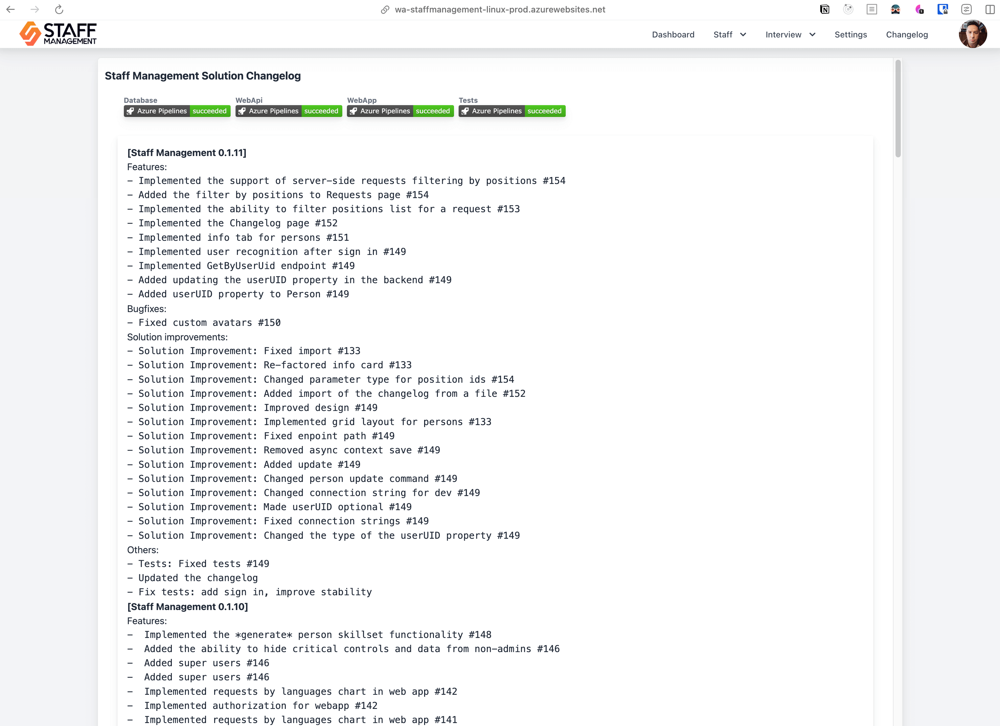

**Table of Contents**

- [Introduction](#introduction)
- [Process Standards and Recommendations](#process-standards-and-recommendations)
  - [Human Resources (HR)](#human-resources-hr)
    - [Tools](#tools)
    - [Onboarding](#onboarding)
    - [Qualification Monitoring and Training](#qualification-monitoring-and-training)
  - [Project Management and Collaboration](#project-management-and-collaboration)
    - [Communication and Process Workflows](#communication-and-process-workflows)
    - [Project Management Tools and Resources](#project-management-tools-and-resources)
    - [Default Project Model and Team Activities](#default-project-model-and-team-activities)
  - [Development](#development)
    - [Version Control and Branching](#version-control-and-branching)
    - [Code Style and Formatting](#code-style-and-formatting)
      - [IDE/Editor Configuration](#ideeditor-configuration)
      - [Linters and Formatters](#linters-and-formatters)
      - [Commit Message Validation](#commit-message-validation)
      - [Commit Message Standards](#commit-message-standards)
    - [Web API Development Conventions](#web-api-development-conventions)
      - [REST Compliance](#rest-compliance)
      - [REST Methods](#rest-methods)
      - [Resource Structures](#resource-structures)
    - [Containerization](#containerization)
      - [Dockerfile and Docker Compose Requirements](#dockerfile-and-docker-compose-requirements)
      - [General Recommendations](#general-recommendations)
    - [Optimizations](#optimizations)
  - [Documentation](#documentation)
    - [Web API, Serverless, and Data Contracts](#web-api-serverless-and-data-contracts)
    - [Release Changelogs](#release-changelogs)
  - [Testing](#testing)
  - [Deployment](#deployment)
    - [Cloud Providers](#cloud-providers)
  - [Security](#security)
    - [Backup Policy](#backup-policy)
    - [External Access](#external-access)
    - [Vulnerability and Dependency Management](#vulnerability-and-dependency-management)
- [Official Resources](#official-resources)

---

# Introduction

This document presents Marka’s official processes, standards, and best practices. It ensures that all teams operate with consistency, quality, and efficiency, while maintaining alignment with organizational goals. Use this guide as a reference for standard operating procedures, technical conventions, and recommended workflows across all projects and departments within Marka.

---

# Process Standards and Recommendations

## Human Resources (HR)

### Tools

Marka employs a custom “Staff Management” solution for handling HR-related processes, including candidate management, employee skill assessments, and professional development tracking. This system streamlines HR operations, improving efficiency and automation.


**Access:** [Staff Management System](https://wa-staffmanagement-linux-prod.azurewebsites.net)  
Obtain credentials from Marka’s CTO.

### Onboarding

When onboarding a new employee, the following steps must be taken:

- Create an Entra ID (Azure AD) account in the `marka-software.company` domain.
- Set up a Staff Management System account.
- Create a Kimai time-tracking account (with project and customer configuration if required).
- Conduct an introductory call and provide all necessary credentials and accesses.

Post-onboarding, essential information (contacts, benefits, process standards, tools, licenses) is available under the user’s personal tab in the Staff Management System.

### Qualification Monitoring and Training

Staff Management System automatically tracks required and current qualifications for each employee. Regular personal development plans (PDPs) and feedback sessions ensure continuous professional growth and market relevance. Interns and junior staff must undergo automatic skill checks every two weeks; schedules for other roles are determined individually.

---

## Project Management and Collaboration

### Communication and Process Workflows

For internal and managed projects, all corporate communication should occur via Marka’s self-hosted Mattermost solution.


For critical project workflows, configure and use automated playbooks within Mattermost, such as those for incident resolution:


### Project Management Tools and Resources

Azure DevOps Projects is the default choice for project management. Jira and Confluence may be used as secondary or training platforms. Marka’s Azure and Atlassian subscriptions must be used exclusively for company projects and staff skill development.

### Default Project Model and Team Activities

The standard project methodology is Scrum with two-week sprints.  
Daily stand-ups (at least twice a week), sprint planning, and sprint reviews are recommended. Sprint reviews can be conducted on demand.


---

## Development

### Version Control and Branching

Use Git for all projects, with Azure DevOps Repos or GitHub for repository hosting.  
For large projects, adopt the Git Flow model. For smaller projects, a simplified branching strategy may be used:

- **main:** fully tested, production-ready code
- **dev:** active development branch
- **feature:** optional feature branches for major changes
- **bugfix:** optional bugfix branches

Tag releases in `main` with version numbers. For small/training projects, `main` and `dev` branches may suffice.

### Code Style and Formatting

Maintain high-quality, consistent, and maintainable code by establishing corporate code standards and enforcing them via automated git hooks or dedicated tasks in CI/CD pipelines.

#### IDE/Editor Configuration

Use `.editorconfig` (https://github.com/editorconfig) or other standardized configuration files for consistent formatting and styling.
Find pre-configured `.editorconfig` files for C#, JavaScript and Python in the repository (https://github.com/Nakishev/MarkaStandards/tree/main/Configs/Editor).

#### Linters and Formatters

Employ linters and formatters to enforce code style rules automatically.
For C# projects, use `Roslyn` custom rules configured in the `.editorconfig` file and enforce 'treat warnings as errors' option.
To apply code style rules automatically, use `CSharpier`.
In JavaScript projects, use `Binome` as both linter and formatter.

#### Commit Message Validation

Use Husky and lint-staged with conventional commit rules to ensure commit messages meet corporate standards.

#### Commit Message Standards

Commit messages should be clear and descriptive, including:

- Change type (feat, fix, refactor, etc.)
- Brief summary
- Task/issue number
- Optional detailed lists of changes and rationale

**Example:**

```
feat: Enhance portfolio period aggregation #1287

Extended IPortfolioService and PortfolioService for optional filtering of portfolio period histories.
Modified PortfolioController to accept a currentPeriodOnly query parameter.
Improved UpdateCurrentPrices logic for recalculation after price updates.
These enhancements increase flexibility and usability of the portfolio period aggregation feature.
```

---

### Web API Development Conventions

#### REST Compliance

Adhere to REST principles (Level 0–2 of Richardson Maturity Model). Level 3 (Hypermedia) is optional.

#### REST Methods

Below is a list of methods that Marka REST services SHOULD support. Not all resources will support all methods, but all resources using the methods below MUST conform to their usage.

| Method | Description                                                         | Is Idempotent |
| ------ | ------------------------------------------------------------------- | ------------- |
| GET    | Return the current value of an object                               | True          |
| PUT    | Replace an object, or create a named object, when applicable        | True          |
| DELETE | Delete an object                                                    | True          |
| POST   | Create a new object based on the data provided, or submit a command | False         |
| PATCH  | Apply a partial update to an object                                 | False         |

#### Resource Structures

Use nouns, logical URI patterns, and query parameters for filtering/sorting. Avoid verbs in URIs and rely on HTTP methods to represent actions.

**Examples:**

```
GET /device-management/managed-devices // Retrieve all devices POST /device-management/managed-devices // Create a new device GET /device-management/managed-devices/{id} // Retrieve a single device
```

**Use hyphens (-) to improve the readability of URIs**
To make your URIs easy for people to scan and interpret, use the hyphen (-) character to improve the readability of names in long-path segments.

```
http://api.example.com/api/managed-devices /*correct*/
http://api.example.com/api/manageddevices/ /*incorrect*/
```

**Use lowercase letters in URIs**
When convenient, lowercase letters should be consistently preferred in URI paths.

```
http://api.example.org/api/my-folders/my-doc  /*correct*/
HTTP://API.EXAMPLE.ORG/api/my-folders/my-doc  /*incorrect*/
http://api.example.org/api/My-Folders/my-doc  /*incorrect*/
```

**Use imperative style for endpoint summaries.**
There are two styles of summaries: imperative (e.g. "Create an item") and declarative (e.g. "Creates an item").

"Create an item" (Preferred)

- Imperative style: Reads like a command or instruction to the client.
- Commonly used in documentation as it describes the action the endpoint performs.
- Consistent with how other API specifications (e.g., OpenAPI, REST APIs) are typically written.
- Matches the usual tense of HTTP verbs (e.g., POST, GET):

```
POST /api/items – "Create an item"
GET /api/items – "Get a list of items"
```

Example in OpenAPI specification:

```
"paths": {
  "/items": {
    "post": {
      "summary": "Create an item",
      "description": "Creates a new item in the inventory."
    }
  }
}

```

**Versioning**
Use semantic versioning for APIs and increment versions upon breaking changes.

### Containerization

All developed projects and infrastructure components must be containerized (if it is technically possible) to ensure portability, scalability, and compatibility across various deployment environments (even if the project is not yet supposed to be deployed or used as containerized application). The containerized solutions should meet the following requirements:

- Flexibility in Deployment:
  - Must be capable of running as a standalone container or as part of a Docker Compose stack.
  - Ready for deployment to any cloud provider as a containerized application.
  - Fully compatible with Kubernetes clusters for seamless orchestration and scaling.
- Support for Integration Testing:
  - Must be usable in automated testing frameworks, such as Testcontainers, to enable robust and consistent integration testing.
- Standardized Tooling:
  - Docker must be used as the primary tool for containerization to maintain consistency and alignment with industry standards.

Docker must be used as the primary tool for containerization to maintain consistency and alignment with industry standards.

#### Dockerfile and Docker Compose Requirements

1. Dockerfile

- Every project must include a Dockerfile located in the root directory of the project.
- The Dockerfile should be:

  - Functional: Able to build and run the containerized application without errors.
  - Efficient: Optimized for performance and image size.
  - Up-to-date: Regularly maintained to reflect the current state of the project.

2. Docker Compose File

- The solution must include a default docker-compose.yml file located in the root directory of the solution.
- The docker-compose.yml file should:
  - Define all the necessary services, networks, and volumes required to run the solution in a containerized environment.
  - Be actual and functional, ensuring all services can be started and interact correctly.
  - Support local development and testing scenarios by including configurations for required dependencies (e.g., databases, message brokers).

#### General Recommendations

- **Use Multi-Stage Builds**  
  Optimize the build process by separating build and runtime stages to reduce the final image size.

- **Prefer Alpine-Based Images**  
  Utilize lightweight Alpine-based images wherever possible to ensure smaller and more secure containers.

- **Minimize Image Size and Layer Count**

  - Combine related `RUN` instructions to reduce the number of layers (use `&&` operator).
  - Remove unnecessary files and dependencies to keep the image lean.

- **Use `.dockerignore`**  
  Exclude unnecessary files (e.g., build artifacts, local configurations) from being copied into the image.

### Optimizations

Leverage tools to analyze and optimize Docker images:

- **[Dive](https://github.com/wagoodman/dive)**  
  A tool for exploring and analyzing Docker images to improve image efficiency and layer usage.

- **[Slim](https://github.com/slimtoolkit/slim?tab=readme-ov-file)**  
  A tool for automatically slimming down Docker images by identifying and removing unnecessary parts.

By following these guidelines, teams can ensure that Docker images are efficient, secure, and optimized for performance.

## Documentation

All standard documentation (API specs, serverless definitions, data contracts, release notes) should be automatically generated and consistently maintained.

### Web API, Serverless, and Data Contracts

Use SwaggerUI or Scalar for API documentation. Scalar is preferred for enhanced capabilities.

SwaggerUI:


Scalar:


### Release Changelogs

Generate release changelogs automatically (using a custom script) from standardized commit messages.

An example of a changelog, generated with a custom script from commit messages:



---

## Testing

Adopt a comprehensive, automated testing strategy including unit, integration, and end-to-end tests as appropriate for each project.

---

## Deployment

### Cloud Providers

- **Azure**  
  Azure is the primary and preferred cloud platform, leveraging its robust capabilities and Marka's Microsoft Partner status for seamless integration and support.

- **AWS and GCP**  
  These platforms may be utilized for:
  - Expanding team skill sets in multi-cloud environments.
  - Addressing specific project requirements where Azure may not be the optimal solution.

By prioritizing Azure while remaining open to AWS and GCP, the team ensures adaptability and expertise across multiple cloud platforms.

---

## Security

### Backup Policy

Maintain regular backups and test restoration procedures to ensure data integrity and availability.

### External Access

Restrict external access to necessary endpoints. Use secure authentication, authorization methods, and encryption where appropriate.

### Vulnerability and Dependency Management

Regularly scan for vulnerabilities in libraries and packages. Promptly address discovered issues to maintain security and stability.

---

# Official Resources

- [Official Public Site](https://marka-development.com/)
- [Staff Management System](https://wa-staffmanagement-linux-prod.azurewebsites.net)
- [Marka’s Process Standards (GitHub)](https://github.com/Nakishev/MarkaStandards)
