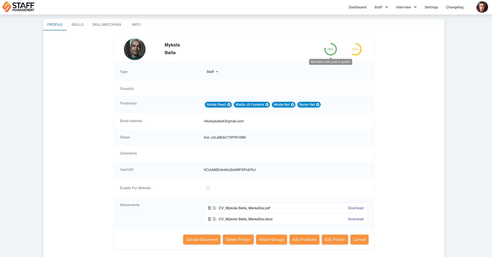
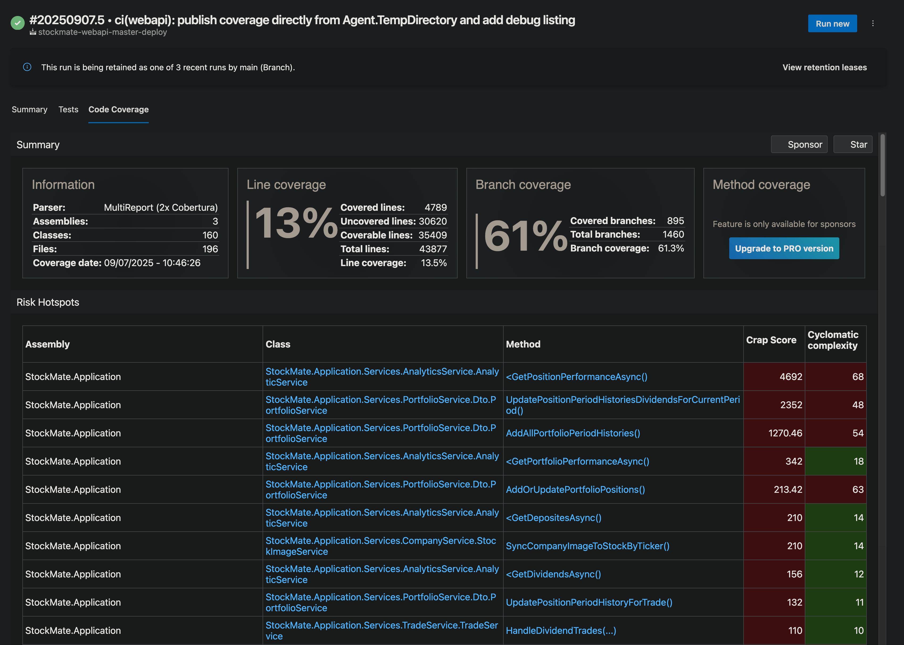

**Table of Contents**

- [Introduction](#introduction)
    - [Applicability and Exceptions](#applicability-and-exceptions)
    - [Process Maturity Levels](#process-maturity-levels)
- [Process Standards and Recommendations](#process-standards-and-recommendations)
  - [Human Resources (HR)](#human-resources-hr)
    - [Tools](#tools)
    - [Onboarding](#onboarding)
    - [Qualification Monitoring and Training](#qualification-monitoring-and-training)
      - [Monitoring and Skill Assessment](#monitoring-and-skill-assessment)
      - [Skill Score Requirements](#skill-score-requirements)
      - [Viewing Skills](#viewing-skills)
      - [Conducting Skill Checks and Interviews](#conducting-skill-checks-and-interviews)
      - [Viewing Interview Results](#viewing-interview-results)
  - [Project Management and Collaboration](#project-management-and-collaboration)
    - [Communication and Process Workflows](#communication-and-process-workflows)
    - [Project Management Tools and Resources](#project-management-tools-and-resources)
    - [Default Project Model and Team Activities](#default-project-model-and-team-activities)
  - [Development](#development)
    - [Version Control and Branching](#version-control-and-branching)
    - [Technology Stack and Tooling Approval](#technology-stack-and-tooling-approval)
    - [Code Style and Formatting](#code-style-and-formatting)
      - [IDE/Editor Configuration](#ideeditor-configuration)
      - [Linters and Formatters](#linters-and-formatters)
      - [Commit Message Validation](#commit-message-validation)
      - [Commit Message Standards](#commit-message-standards)
    - [Code Review and Pull Requests](#code-review-and-pull-requests)
      - [Creating a Pull Request](#creating-a-pull-request)
      - [Review Process](#review-process)
      - [Merging](#merging)
    - [Automated Dependency Updates](#automated-dependency-updates)
    - [Framework-Specific Guidelines](#framework-specific-guidelines)
      - [React](#react)
        - [Component Structure and Props](#component-structure-and-props)
    - [Web API Development Conventions](#web-api-development-conventions)
      - [REST Compliance](#rest-compliance)
      - [REST Methods](#rest-methods)
      - [Resource Structures](#resource-structures)
      - [Error Handling and Status Codes](#error-handling-and-status-codes)
      - [Pagination, Filtering, and Sorting](#pagination-filtering-and-sorting)
      - [Idempotency](#idempotency)
      - [Versioning and Deprecation](#versioning-and-deprecation)
      - [Caching and Rate Limiting](#caching-and-rate-limiting)
      - [Data Formats](#data-formats)
    - [Observability](#observability)
      - [Low-scale solutions (demo, training, etc. projects)](#low-scale-solutions-demo-training-etc-projects)
      - [High-scale solutions for production](#high-scale-solutions-for-production)
        - [Logs](#logs)
          - [Semantic Conventions](#semantic-conventions)
          - [Best Practices to follow](#best-practices-to-follow)
        - [Metrics](#metrics)
          - [Required Metrics](#required-metrics)
          - [Metric Types](#metric-types)
        - [Distributed Tracing](#distributed-tracing)
          - [Trace Requirements](#trace-requirements)
          - [Sampling Strategy](#sampling-strategy)
      - [Alerting and Uptime Monitoring](#alerting-and-uptime-monitoring)
    - [Containerization](#containerization)
      - [Dockerfile and Docker Compose Requirements](#dockerfile-and-docker-compose-requirements)
      - [General Recommendations](#general-recommendations)
      - [Image Optimizations](#image-optimizations)
      - [Image Tagging and Retention](#image-tagging-and-retention)
  - [Documentation](#documentation)
    - [Web API, Serverless, and Data Contracts](#web-api-serverless-and-data-contracts)
    - [Architecture and ADRs](#architecture-and-adrs)
    - [Release Changelogs](#release-changelogs)
    - [Test Reports](#test-reports)
      - [Recommended Tools:](#recommended-tools)
  - [Testing](#testing)
    - [Test Types](#test-types)
    - [Additional Notes](#additional-notes)
    - [Resources](#resources)
  - [Deployment](#deployment)
    - [Cloud Providers](#cloud-providers)
      - [Azure](#azure)
      - [Azure Resources Naming Conventions](#azure-resources-naming-conventions)
      - [Azure Resource Governance](#azure-resource-governance)
    - [DevOps Practices](#devops-practices)
      - [Deployment Types](#deployment-types)
      - [CI/CD Pipelines](#cicd-pipelines)
        - [Example: .NET tests + Cobertura coverage publishing (Azure DevOps)](#example-net-tests--cobertura-coverage-publishing-azure-devops)
      - [Code Quality Analysis (SonarQube Community Edition)](#code-quality-analysis-sonarqube-community-edition)
      - [Orchestration and Scheduled Tasks](#orchestration-and-scheduled-tasks)
      - [Infrastructure as Code (IaC)](#infrastructure-as-code-iac)
  - [Security](#security)
    - [Backup Policy](#backup-policy)
      - [Objects/Entities to Backup](#objectsentities-to-backup)
      - [Key Principles](#key-principles)
      - [Backup Locations and Security](#backup-locations-and-security)
      - [Monitoring and Notifications](#monitoring-and-notifications)
      - [Policy Guidelines](#policy-guidelines)
      - [Recommended Tools](#recommended-tools-1)
    - [External Access](#external-access)
      - [Access to Internal Resources](#access-to-internal-resources)
      - [Secure Database Access](#secure-database-access)
      - [Web Application Protection](#web-application-protection)
      - [Authentication and Authorization](#authentication-and-authorization)
      - [Monitoring and Auditing](#monitoring-and-auditing)
    - [Vulnerability and Dependency Management](#vulnerability-and-dependency-management)
    - [Secrets Management](#secrets-management)
  - [Tools, Libraries, and Services](#tools-libraries-and-services)
- [Official Resources](#official-resources)

---

# Introduction

This document presents Marka’s official processes, standards, and best practices. It ensures that all teams operate with consistency, quality, and efficiency, while maintaining alignment with organizational goals. Use this guide as a reference for standard operating procedures, technical conventions, and recommended workflows across all projects and departments within Marka.

### Applicability and Exceptions

While this document defines Marka’s standards, some projects (e.g., small scope, legacy constraints, tech‑stack limitations, budget restrictions, limited cloud availability, or explicit customer requirements) may treat it as guidance and best practices rather than strict policy. In such cases, apply these principles pragmatically and document any deviations and their rationale in the project’s README or architecture/ADR notes.

### Process Maturity Levels

Use the following levels to describe and plan the maturity of a project’s processes relative to Marka’s standards:

- Level 1 — Baseline (Guideline Adoption)
  - Basic branching and PRs; tests for business logic changes; manual or simple scripted deployments acceptable.
  - Core code style followed informally; minimal logging/monitoring; ad‑hoc backups.
  - Document deviations and a plan to improve where practical.
- Level 2 — Standardized (Core Standard)
  - Enforced code style and PR process; CI with lint/format/build/unit tests/coverage gates.
  - Containerized services with health checks; environments (dev/stage/prod) with approvals; secrets via Key Vault.
  - Basic observability and release tagging; documented rollback procedures.
- Level 3 — Advanced (Full Standard)
  - Comprehensive observability (OTel logs/metrics/traces, Azure AppInsights, Azure Log Workspaces); code coverage thresholds (≥80% overall, ≥90% for critical modules) with reports published in Azure DevOps; IaC for infra; scheduled workflows (e.g., Azure Functions, Kestra); uptime monitoring (Azure Monitor, Uptime Kuma); and governance (Azure Policy, budgets, tags).
  - Formal architecture/ADRs; per‑service README with run/test/deploy instructions.
- Level 4 — Secure & Intelligent (Elite Standard)
  - Security-by-default gates: mandatory Snyk scans (Code/SAST, Open Source/SCA+licenses, Container, IaC) on PRs and main; fail on high/critical by default; nightly/weekly scheduled scans and ACR/registry scanning; documented remediation SLAs (critical ≤7 days, high ≤30 days).
  - Deep code quality analysis: SonarQube CE integrated into pipelines; Cobertura coverage imported; enforce Quality Gate on new code (coverage ≥80% on new code, duplication ≤3%, Maintainability and Reliability ratings A); block merges on gate failure.
  - Secrets protection: all secrets in Key Vault; mandatory secret scanning (e.g., Gitleaks) in CI and at repo host; pipelines fail on detected secrets.
  - Coverage as a gate: branch and line coverage thresholds enforced per component; critical modules target ≥90% line and meaningful branch coverage; publish risk hotspots and coverage dashboards in Azure DevOps.
  - Supply chain hardening: pin/lock dependencies; signed container images where applicable; container base images kept current; Snyk Container gating active on images built in CI.
  - Governance & compliance: policy‑as‑code (Azure Policy), environment approvals and audit trails, release tagging and changelogs; periodic security/quality reviews with action items tracked.

Define the current and target maturity level at project kick‑off and revisit each quarter or major release.

---

# Process Standards and Recommendations

## Human Resources (HR)

### Tools

Marka employs a custom “Staff Management” solution for handling HR-related processes, including candidate management, employee skill assessments, and professional development tracking. This system streamlines HR operations, improving efficiency and automation.


**Access:** [Staff Management System](https://wa-staffmanagement-linux-prod.azurewebsites.net)  
Obtain credentials from Marka’s CTO.

### Onboarding

When onboarding a new employee, the following steps must be taken:

- Create an Entra ID (Azure AD) account in the `marka-software.company` domain.
- Set up a Staff Management System account.
- Create a Kimai time-tracking account (with project and customer configuration if required).
- Conduct an introductory call and provide all necessary credentials and accesses.

Post-onboarding, essential information (contacts, benefits, process standards, tools, licenses) is available under the user’s personal tab in the Staff Management System.

### Qualification Monitoring and Training

The Staff Management System automatically tracks both required and current qualifications for each employee, ensuring alignment with professional standards. Regular Personal Development Plans (PDPs) and feedback sessions facilitate continuous growth and relevance in the market.

#### Monitoring and Skill Assessment

- **Interns and Juniors**: Skill checks to be conducted in Staff Management System every two weeks.
- **Other Roles**: Assessment schedules are determined individually.

The system calculates a **skill score** for each employee, divided into two categories:

1. **Mandatory Qualifications**: Required for the employee's position.
2. **Optional Qualifications**: Additional skills that enhance the employee’s role.

Skill scores are derived from the number of skills linked to the employee via completed tasks or automatic skill checks (internal interviews). Current scores are displayed on the employee's personal page in the Staff Management System.



#### Skill Score Requirements

- **Mandatory Qualifications**: A minimum score of **70%** is required for qualification.
- **Optional Qualifications**: A minimum score of **50%** is required for qualification.

#### Viewing Skills

To review linked skills:

1. Open the `Skillmatching` tab on the employee's personal page.
2. Toggle to `Matched` to view skills already obtained and proved.


Skills that still need to be acquired appear under the `Mismatched` toggle.


#### Conducting Skill Checks and Interviews

To initiate a new skill check or interview:

1. Navigate to `Interview -> New Interview`.
2. Click **Check My Skills**.
3. Select a position for skill assessment.
4. Complete the proposed questions and submit the results.

For targeted skill improvement, employees can add a specific topic under the selected position before starting the interview.


#### Viewing Interview Results

Results from completed interviews can be accessed under `Interview -> History` in the Staff Management System.

---

## Project Management and Collaboration

### Communication and Process Workflows

For internal and managed projects, all corporate communication should occur via Marka’s self-hosted Mattermost solution. Microsoft Teams may be used instead if the team prefers it and there are no strict requirements to self-host project communications or avoid 3rd-party apps. Document the chosen tool in project documentation and ensure it aligns with customer requirements.


For critical project workflows, configure and use automated playbooks within Mattermost, such as those for incident resolution:


### Project Management Tools and Resources

Azure DevOps Projects is the default choice for project management. Jira and Confluence may be used as secondary or training platforms. Marka’s Azure and Atlassian subscriptions must be used exclusively for company projects and staff skill development.

### Default Project Model and Team Activities

The standard project methodology is Scrum with two-week sprints.  
Daily stand-ups (at least twice a week), sprint planning, and sprint reviews are recommended. Sprint reviews can be conducted on demand.


---

## Development

### Version Control and Branching

Use Git for all projects, with Azure DevOps Repos or GitHub for repository hosting.  
For large projects, adopt the Git Flow model. For smaller projects, a simplified branching strategy may be used:

- **main:** fully tested, production-ready code
- **dev:** active development branch
- **feature:** optional feature branches for major changes
- **bugfix:** optional bugfix branches

Tag releases in `main` with version numbers. For small/training projects, `main` and `dev` branches may suffice.

Git branches naming convention:

- Use lowercase letters and hyphens to separate words (kebab-case)
- Include a category prefix like feature/, bugfix/, hotfix/, or docs/
- Keep names descriptive but concise
- Incorporate issue or ticket numbers when applicable
- Avoid using only numbers
- Use clear, meaningful names that explain the branch's purpose

Examples:

- feature/add-user-authentication
- bugfix/login-page-error
- hotfix/security-vulnerability-123

In projects with extreme level of collaboration, it is acceptable to put developer initials in the branch name.
Typical format in this case: [category]/[initials]-[description]

Examples:

- feature/jd-user-login
- bugfix/mp-database-connection

### Technology Stack and Tooling Approval

- Customer alignment: Project technology stack (languages, frameworks, databases, cloud services) must be agreed with the customer and approved by the Tech Lead/Architect/Team Lead.
- Internal tools and services: Any new 3rd-party development tool/service to be used within Marka’s infrastructure must be pre-approved by the CTO and an infrastructure engineer/admin, and must comply with company security, licensing, and data-protection policies.
- Network resources: Opening ports, changing firewall rules, VNet/VPN changes, exposing public endpoints, or provisioning additional networked resources require prior approval by the CTO + infrastructure engineer/admin. Include purpose, ports/protocols, environment/scope, duration, and owner in the request.
- Documentation: Record approved stacks and tools in the repository (README or ADRs in docs/adr/) and keep them up to date. Prefer using already-approved, standard tools when possible.
- Safety first: Trial new tools in non-production/sandbox environments; do not store customer data during evaluations; remove unused tooling/services after trials.

### Code Style and Formatting

Maintain high-quality, consistent, and maintainable code by establishing corporate code standards and enforcing them via automated git hooks or dedicated tasks in CI/CD pipelines.

#### IDE/Editor Configuration

Use `.editorconfig` (https://github.com/editorconfig) or other standardized configuration files for consistent formatting and styling.
Find pre-configured `.editorconfig` files for C#, JavaScript and Python in the repository (https://github.com/Nakishev/MarkaStandards/tree/main/Configs/Editor).

#### Linters and Formatters

Employ linters and formatters to enforce code style rules automatically.

- C#: Use `CSharpier` as the formatter; use Roslyn/StyleCop analyzers for linting and enable 'treat warnings as errors'.
- JavaScript: Use `Biome` as both linter and formatter.

#### Commit Message Validation

- All projects must follow Conventional Commits for clarity and automated changelogs.
- JavaScript projects: Use Husky + lint-staged and `commitlint` to enforce rules locally.
- C# projects: Use `CSharpier` as the formatter; use analyzers (Roslyn/StyleCop) for linting; enforce commit message rules via CI (pipeline checks) or server-side hooks.
- Alternative to pre-commit hooks: Teams that prefer faster pushes can run style/lint and commit message checks in CI instead of local hooks. In that case, block merges if checks fail.

#### Commit Message Standards

Commit messages should be clear and descriptive, including:

- Change type (feat, fix, refactor, etc.)
- Brief summary
- Task/issue number
- Optional detailed lists of changes and rationale

**Example:**

```
feat: Enhance portfolio period aggregation #1287

Extended IPortfolioService and PortfolioService for optional filtering of portfolio period histories.
Modified PortfolioController to accept a currentPeriodOnly query parameter.
Improved UpdateCurrentPrices logic for recalculation after price updates.
These enhancements increase flexibility and usability of the portfolio period aggregation feature.
```

---

### Code Review and Pull Requests

Code reviews help us ship fast without breaking quality. Keep it simple, respectful, and pragmatic.

#### Creating a Pull Request

- Base against the correct branch: `dev` for staging, `main` for production releases (see Version Control and Branching).
- Keep PRs small and focused. As a rule of thumb, prefer ≤ 400 changed lines (excluding generated files). Split big work into incremental PRs.
- Title uses Conventional Commits style: `feat: short summary (#123)`; include the work item/issue number when applicable.
- Description includes:
  - What changed and why (context/problem statement and approach)
  - How it was implemented (key design decisions)
  - Testing done (how to reproduce, test cases, environments)
  - Screenshots/GIFs for UI changes
  - Backward compatibility, migrations, rollout/rollback plan if relevant
- Mark as Draft if work is in progress or awaiting dependencies.
- PR checklist (author verifies before requesting review):
  - Formatting and linters applied; no new warnings (C#: treat warnings as errors; JS: linter clean)
  - If the PR changes business logic, include unit tests covering the implemented/modified behavior; update existing tests as needed (explain any exceptions in the description)
  - All tests pass locally; new/updated tests added where it makes sense
  - Docs updated (API/Contracts/README) if behavior or interfaces changed
  - Changelog/version updated when user-facing behavior changes
  - No secrets/credentials in code, config, or diffs; use env/Key Vault instead
  - Container image builds locally (if applicable)

#### Review Process

- Approvals: at least 1 reviewer for normal changes; 2 for risky/production-impacting changes (migrations, auth, security, perf-sensitive paths).
- Use CODEOWNERS or repository reviewer rules when available (GitHub/Azure DevOps both supported).
- Turnaround: aim to start review within 1 business day. Authors should respond within 1 business day as well.
- Author responsibilities:
  - Self-review before requesting review; run the full local/CI checks
  - Address every comment (code change or a reply) and resolve conversations when done
  - Avoid force-push/rebase after reviews begin unless necessary; communicate if you must
- Reviewer responsibilities:
  - Be specific, kind, and solution-oriented; prefer suggested edits for nits
  - Focus on correctness, design, security/privacy, performance, tests, and consistency with our standards
  - Approve when ready; use “Request changes” for blocking issues; use comments for non-blocking suggestions

#### Merging

- All required CI checks must be green (build, tests, linters; security/dependency scans when configured).
- Prefer Squash & Merge to keep history clean. Use the PR title as the commit message (Conventional Commits), and include the PR/issue number.
- Delete the feature branch after merge.
- When merging to `main`, tag releases and follow the Versioning guidance.
- For risky changes (migrations, infra): agree on rollout and rollback, and monitor after deployment.

---

### Automated Dependency Updates

To keep project dependencies up to date, teams may adopt Renovate where it makes sense for the project. Configure Renovate to create automated pull requests for dependency updates and integrate it into your CI/CD pipelines and PR review flow (scheduling, grouping, and rules can be tailored per repository or via shared presets). See https://docs.renovatebot.com/ for setup and configuration details.

---

### Framework-Specific Guidelines

#### React

##### Component Structure and Props

To ensure consistency and maintainability in React components, follow these guidelines for props and internal structure.

**Component Props:**

- **Use Interfaces for Props:** Always define component props using TypeScript `interface` instead of `type`.
- **Naming Convention:** Append `Props` to the interface name for clarity (e.g., `MyComponentProps`).

**Component Internal Structure:**

Organize the inside of your React components in the following order to improve readability and predictability:

1.  **Hooks:** Group all hooks at the top.
    - Start with context hooks (e.g., `useAuth`).
    - Follow with state hooks (`useState`, `useReducer`).
    - Then, reference hooks (`useRef`).
2.  **Effects:** Place `useEffect` hooks after all other hooks.
3.  **Helper Functions:** Define component-specific helper functions.
    - _Note: Universal or reusable helper functions should be placed in a dedicated `helpers` folder outside the component._
4.  **Event Handlers:** Define all event handlers (e.g., `handleClick`, `onChange`).
5.  **Early Returns:** Implement any early returns (e.g., for loading or error states) to avoid nested logic.
6.  **Render Logic:** Prepare any variables or constants needed for rendering.
    - Example: `const buttonText = isLoading ? 'Loading...' : 'Submit';`
7.  **Return Statement:** Finally, the JSX to be rendered.

---

### Web API Development Conventions

#### REST Compliance

Adhere to REST principles (Level 0–2 of Richardson Maturity Model). Level 3 (Hypermedia) is optional.

#### REST Methods

Below is a list of methods that Marka REST services SHOULD support. Not all resources will support all methods, but all resources using the methods below MUST conform to their usage.

| Method | Description                                                         | Is Idempotent |
| ------ | ------------------------------------------------------------------- | ------------- |
| GET    | Return the current value of an object                               | True          |
| PUT    | Replace an object, or create a named object, when applicable        | True          |
| DELETE | Delete an object                                                    | True          |
| POST   | Create a new object based on the data provided, or submit a command | False         |
| PATCH  | Apply a partial update to an object                                 | False         |

#### Resource Structures

Use nouns, logical URI patterns, and query parameters for filtering/sorting. Avoid verbs in URIs and rely on HTTP methods to represent actions.

**Examples:**

```
GET  /device-management/managed-devices         // Retrieve all devices
POST /device-management/managed-devices         // Create a new device
GET  /device-management/managed-devices/{id}    // Retrieve a single device
```

**Use hyphens (-) to improve the readability of URIs**
To make your URIs easy for people to scan and interpret, use the hyphen (-) character to improve the readability of names in long-path segments.

```
http://api.example.com/api/managed-devices /*correct*/
http://api.example.com/api/manageddevices/ /*incorrect*/
```

**Use lowercase letters in URIs**
When convenient, lowercase letters should be consistently preferred in URI paths.

```
http://api.example.org/api/my-folders/my-doc  /*correct*/
HTTP://API.EXAMPLE.ORG/api/my-folders/my-doc  /*incorrect*/
http://api.example.org/api/My-Folders/my-doc  /*incorrect*/
```

**Use imperative style for endpoint summaries.**
There are two styles of summaries: imperative (e.g. "Create an item") and declarative (e.g. "Creates an item").

"Create an item" (Preferred)

- Imperative style: Reads like a command or instruction to the client.
- Commonly used in documentation as it describes the action the endpoint performs.
- Consistent with how other API specifications (e.g., OpenAPI, REST APIs) are typically written.
- Matches the usual tense of HTTP verbs (e.g., POST, GET):

```
POST /api/items – "Create an item"
GET /api/items – "Get a list of items"
```

Example in OpenAPI specification:

```
"paths": {
  "/items": {
    "post": {
      "summary": "Create an item",
      "description": "Creates a new item in the inventory."
    }
  }
}

```

#### Error Handling and Status Codes

- Return a consistent error envelope: `{ code, message, details?, traceId }`.
- Map standard status codes: 400 (validation), 401, 403, 404, 409, 422, 429, 500.
- Include `traceId` for correlation and troubleshooting.

#### Pagination, Filtering, and Sorting

- Use `page` and `pageSize` query params (apply sensible defaults and server-side max limits).
- Use `filter[field]=value` and `sort=field,-otherField` conventions.
- Return pagination metadata: `total`, `page`, `pageSize`.

#### Idempotency

- For operations that clients may retry (e.g., create), support `Idempotency-Key` header to prevent duplicate effects.

#### Versioning and Deprecation

- Use semantic versioning for APIs. Prefer versioning in the path (e.g., `/v1`) for public APIs; headers are acceptable for internal services.
- Announce deprecations with `Deprecation` and `Sunset` headers and documentation; provide migration guidance and timelines.

#### Caching and Rate Limiting

- For GET endpoints, support `ETag`/`If-None-Match` and appropriate `Cache-Control`; return 304 when unchanged.
- Document rate limits. On throttle, return 429 with `Retry-After`.

#### Data Formats

- JSON property names use camelCase.
- Timestamps use RFC3339/ISO 8601 in UTC (e.g., `2024-01-02T03:04:05Z`).
- Prefer stable string enums over numeric codes.

---

### Observability

#### Low-scale solutions (demo, training, etc. projects)

Use Azure AppInsights as the primary monitoring tool for low-scale projects.
Use standard severity levels (INFO, WARN, ERROR) for logging and alerting.
Attribute every log message with the prefix within squared brackets containing:

- Solution name
- Project/Service name
- Method name

Example:

```
[StockMate.TransactionService.CreateTransactions] Found 16 transactions to add. Transaction IDs: 1413, 1414, 1415, 1416, 1417, 1418, 1419, 1420, 1421, 1422, 1423, 1424, 1425, 1426, 1427, 1428

```

#### High-scale solutions for production

##### Logs

Use OpenTelemetry compatible logging tools (OpenTelemetry/Azure AppInsights). Prefer standard OpenTelemetry Protocol (OTLP) exporters for maximum compatibility and standardization.

###### Semantic Conventions

Stick to the OpenTelemetry's Logs Data Model ([Logs Data Model](https://opentelemetry.io/docs/specs/otel/logs/data-model/)) when developing log properties and formats.

Preferred list of log attributes:

- `ServiceName`: Name of the service generating the log
- `Timestamp`: Time when the event occurred (UTC)
- `ObservedTimestamp`: Time when the event was observed by the logging system (UTC)
- `SeverityText`: Text representation of severity level (TRACE, DEBUG, INFO, WARN, ERROR, FATAL)
- `SeverityNumber`: Numeric representation of severity (1-24 as per OTel spec)
- `Body`: The primary message content
- `Resource`: Information about the entity producing the log (service, k8s pod, etc.)
- `Attributes`: Additional contextual information as key-value pairs
- `TraceId`: Unique identifier for the trace (for distributed tracing)
- `SpanId`: Unique identifier for the span within the trace
- `TraceFlags`: Trace option flags (e.g., sampling decision)

###### Best Practices to follow

1. Structured Logging

   - Always use structured logging format (JSON)
   - Avoid free-form text in attributes
   - Use semantic conventions for attribute naming

2. Context Propagation

   - Always propagate trace context
   - Include correlation IDs
   - Maintain baggage items where relevant

3. Sampling

   - Implement appropriate sampling strategies
   - Consider head-based sampling for services
   - Use tail-based sampling for error cases

4. Performance

   - Use batching for log exports
   - Implement appropriate buffer sizes
   - Handle backpressure properly

5. Privacy and Compliance

   - Never log secrets or credentials; mask or hash PII and sensitive fields
   - Use redaction filters/middleware where available

6. Cardinality

   - Avoid high-cardinality labels/attributes in metrics; prefer bounded values
   - Limit unique values in logs/traces to control storage and costs

7. Retention

   - Set appropriate data retention periods per environment and customer policy

##### Metrics

Implement standard OpenTelemetry metrics for consistent monitoring across services.

###### Required Metrics

1. Service Health

   - Uptime
   - Memory usage
   - CPU usage
   - Active connections

2. Business Metrics
   - Request rates
   - Error rates
   - Response times
   - Business-specific KPIs

###### Metric Types

Use appropriate OpenTelemetry metric instruments:

1. Counter

   - For values that only increase
   - Example: request_count, error_count

2. Gauge

   - For values that can go up and down
   - Example: memory_usage, active_connections

3. Histogram
   - For distributions of values
   - Example: request_duration, payload_size

##### Distributed Tracing

Implement distributed tracing using OpenTelemetry trace semantics.

###### Trace Requirements

1. Span Naming

   - Use clear, descriptive names
   - Follow the format: `<operation_name>.<context>`
   - Example: `payment.process`, `auth.validate`

2. Required Span Attributes

   - `service.name`
   - `service.version`
   - `deployment.environment`
   - HTTP attributes for web requests
   - Database attributes for queries

3. Error Handling
   - Always mark failed spans with error status
   - Include error details in span attributes
   - Link related logs to spans

###### Sampling Strategy

1. Production Environment

   - Use tail-based sampling
   - Sample 100% of error spans
   - Sample 10% of normal traffic

2. Non-Production Environments
   - Sample 100% of all spans
   - Enable debug spans when needed

#### Alerting and Uptime Monitoring

- Use Uptime Kuma as a self-hosted, cloud-agnostic tool for synthetic checks (HTTP/TCP/etc.), uptime dashboards, and alerting (e.g., email, Teams/Mattermost, webhook).
- Prefer Uptime Kuma within Marka’s infrastructure when customer or project requirements favor self-hosted monitoring and alerting.

---

### Containerization

All developed projects and infrastructure components must be containerized (if it is technically possible) to ensure portability, scalability, and compatibility across various deployment environments (even if the project is not yet supposed to be deployed or used as containerized application). The containerized solutions should meet the following requirements:

- Flexibility in Deployment:
  - Must be capable of running as a standalone container or as part of a Docker Compose stack.
  - Ready for deployment to any cloud provider as a containerized application.
  - Fully compatible with Kubernetes clusters for seamless orchestration and scaling.
- Support for Integration Testing:
  - Must be usable in automated testing frameworks, such as Testcontainers, to enable robust and consistent integration testing.
- Standardized Tooling:
  - Docker must be used as the primary tool for containerization to maintain consistency and alignment with industry standards.

#### Dockerfile and Docker Compose Requirements

1. Dockerfile

- Every project must include a Dockerfile located in the root directory of the project.
- The Dockerfile should be:

  - Functional: Able to build and run the containerized application without errors.
  - Efficient: Optimized for performance and image size.
  - Up-to-date: Regularly maintained to reflect the current state of the project.
  - Health-aware and secure: Define a `HEALTHCHECK`; expose only required ports; run as non-root; drop unnecessary capabilities; prefer read-only filesystem where possible.

2. Docker Compose File

- The solution must include a default docker-compose.yml file located in the root directory of the solution.
- The docker-compose.yml file should:
  - Define all the necessary services, networks, and volumes required to run the solution in a containerized environment.
  - Be actual and functional, ensuring all services can be started and interact correctly.
  - Support local development and testing scenarios by including configurations for required dependencies (e.g., databases, message brokers).
  - Include healthcheck for services and least-privilege security options (non-root user, read-only rootfs, dropped capabilities) where possible.

#### General Recommendations

- **Use Multi-Stage Builds**  
  Optimize the build process by separating build and runtime stages to reduce the final image size.

- **Prefer Alpine-Based Images**  
  Utilize lightweight Alpine-based images wherever possible to ensure smaller and more secure containers.

- **Minimize Image Size and Layer Count**

  - Combine related `RUN` instructions to reduce the number of layers (use `&&` operator).
  - Remove unnecessary files and dependencies to keep the image lean.

- **Use `.dockerignore`**  
  Exclude unnecessary files (e.g., build artifacts, local configurations) from being copied into the image.

- **Harden containers**

  - Run as a non-root user; drop unnecessary Linux capabilities
  - Use a read-only filesystem if possible; mount volumes with least privilege
  - Pin base images by digest when feasible and keep images up to date
  - Expose only required ports and define explicit `HEALTHCHECK`

#### Image Optimizations

Leverage tools to analyze and optimize Docker images:

- **[Dive](https://github.com/wagoodman/dive)**  
  A tool for exploring and analyzing Docker images to improve image efficiency and layer usage.

- **[Slim](https://github.com/slimtoolkit/slim?tab=readme-ov-file)**  
  A tool for automatically slimming down Docker images by identifying and removing unnecessary parts.

By following these guidelines, teams can ensure that Docker images are efficient, secure, and optimized for performance.

#### Image Tagging and Retention

- Tag images with semantic versions (e.g., `1.2.3`); optionally append a short commit SHA for traceability (e.g., `1.2.3+abcd123`).
- Maintain a clear mapping between application releases and image tags.
- Define image retention policies per environment to prune unreferenced or stale tags regularly.

---

## Documentation

Consistently maintain all standard project documentation, including API specifications, serverless definitions, data contracts, release notes, and test reports. Documentation should be automatically generated where possible to ensure accuracy and ease of updates.

### Web API, Serverless, and Data Contracts

Document all Web APIs, serverless functions, and data contracts using robust tools. These tools ensure clarity and provide a consistent interface for developers and stakeholders.

- **Preferred Tool**: **Scalar** for its enhanced documentation capabilities and advanced features.
- **Alternative Tool**: **SwaggerUI** for basic API documentation needs.

**SwaggerUI Example**:


**Scalar Example**:


### Architecture and ADRs

- Capture key architectural decisions as ADRs under `docs/adr/` (use a template); link to major decisions from the README when relevant.
- Use C4 model diagrams (Context/Container/Component) for core systems; store versioned diagrams under `docs/architecture/`.
- Per-service README: each service repository should document run/test/lint/build/deploy instructions and required environment variables.

### Release Changelogs

Automate the generation of release changelogs using standardized commit messages. This ensures a clear and concise history of changes for each release.

- **Best Practice**: Use tools or custom scripts to parse commit messages formatted in a conventional style (e.g., [Conventional Commits](https://www.conventionalcommits.org/)) to generate changelogs automatically.

**Example Changelog**:
Generated using a custom script based on commit messages.


### Test Reports

Share with stakeholders and customers comprehensive release test reports, that are automatically generated using tools integrated with your DevOps pipeline or based on test runs/executions according to the project test plans and created issues/bugs.
These reports provide a detailed view of test results and coverage (if applicable and required) for every release.

#### Recommended Tools:

- **Azure DevOps**: Use built-in test plugins to automatically generate detailed test reports from test executions.
- **Jira**: Leverage Jira test management plugins to integrate with test runs and create comprehensive reports.

**Azure DevOps Test Reports Example**:


**Jira Test Reports Examples**:


---

## Testing

Adopt a comprehensive, automated testing strategy, including unit, integration, and end-to-end tests, as appropriate for each project. Automation enhances reliability, consistency, and speed across the development lifecycle.

### Test Types

| Test Type              | Description                                                                                       | Recommended Tools                                     | Requirement                      |
| ---------------------- | ------------------------------------------------------------------------------------------------- | ----------------------------------------------------- | -------------------------------- |
| Unit Tests             | Validate individual units of code in isolation. TDD is recommended for better code quality.       | XUnit (C#), Jest/Vitest + Testing Library (JS)        | Mandatory for all projects       |
| UI Tests               | Test the graphical user interface of an application.                                              | Playwright                                            | Optional                         |
| Integration Tests      | Ensure that components or services work together as expected.                                     | Testcontainers (C#), Testcontainers + Playwright (JS) | Optional                         |
| End-to-End Tests       | Validate complete workflows from start to finish.                                                 | Playwright                                            | Optional                         |
| Performance/Load Tests | Assess the system's behavior under various conditions, including heavy load and stress scenarios. | gatling, k6, wrk, locust                              | Optional                         |
| Acceptance Tests       | Verify the system meets external stakeholders' requirements and specifications.                   | Playwright, or tool appropriate to project scope      | Optional (for external projects) |

### Additional Notes

- **Unit Tests**: Adopting Test-Driven Development (TDD) ensures higher quality and maintainability, so stick to whenever it's possible.
- Coverage policy: Teams set project-wide coverage thresholds; a typical baseline is ≥ 80% overall, and ≥ 90% for critical modules. Enforce via CI coverage gates.
- **Performance Testing**: Tools like [Gatling](https://gatling.io/) and k6 provide actionable insights into bottlenecks.
- **End-to-End Testing**: Utilize Playwright for comprehensive coverage across browsers and devices.
- Coverage tooling and publishing: .NET—collect with the built-in "XPlat Code Coverage" data collector and publish Cobertura reports in Azure DevOps (optionally generate local HTML with ReportGenerator); JS—use lcov/coverage reporters. Always publish test results and coverage summaries in Azure DevOps.
- Flaky tests policy: mark tests as flaky and quarantine; file an issue, track, and prioritize fixes. Avoid silently ignoring failing tests.
- Test naming and structure: colocate tests next to code or under `tests/`; use clear names (e.g., `Given_When_Then`) and consistent suffixes (e.g., `*Tests.cs`).

### Resources

- [XUnit Documentation](https://xunit.net/)
- [Playwright Testing](https://playwright.dev/)
- [Gatling Load Testing](https://gatling.io/)
- [Testcontainers for JavaScript](https://github.com/testcontainers/testcontainers-js)

---

## Deployment

### Cloud Providers

- **Azure**  
  Azure is the primary and preferred cloud platform, leveraging its robust capabilities and Marka's Microsoft Partner status for seamless integration and support.

- **AWS and GCP**  
  These platforms may be utilized for:
  - Expanding team skill sets in multi-cloud environments.
  - Addressing specific project requirements where Azure may not be the optimal solution.

By prioritizing Azure while remaining open to AWS and GCP, the team ensures adaptability and expertise across multiple cloud platforms.

---

#### Azure

#### Azure Resources Naming Conventions

Follow these rules to keep Azure resource names consistent and compliant:

- Prefix with resource-type abbreviation
  - Examples: `rg` (resource group), `vnet` (virtual network), `snet` (subnet), `kv` (Key Vault), `sa` (storage account), `acr` (Azure Container Registry), `aca` (Azure Container Apps), `app` (App Service), `appins` (Application Insights), `sql` (SQL server/db), `vm` (virtual machine), `nsg` (network security group), `pip` (public IP), `aks` (AKS), `apim` (API Management).
  - Example: `rg-stockmate`.
- Postfix with environment when separate environments are used
  - Use short env codes: `-dev`, `-stg`, `-prod`.
  - Example: `rg-stockmate-prod`.
- Lowercase only
  - Use only lowercase letters and digits.
- Separators and character limits
  - Use hyphens to separate abbreviation, solution name, and qualifiers where the resource type allows them.
  - For resource types that disallow special characters (e.g., storage accounts, some DNS labels, ACR), use a single concatenated word with no separators.
  - Respect Azure length/character constraints for each resource type.
- Keep names concise and avoid redundancy
  - Don’t repeat the resource type in the descriptive part (e.g., avoid `rg-resourcegroup-stockmate`).
- Tagging for grouping across subscriptions
  - Use Azure tags to group resources by solution and environment, especially in complex projects hosted across multiple subscriptions.
  - Recommended tags: `solution`, `environment` (dev/stg/prod), `owner`, `costCenter` (or `project`), `managedBy`.

Examples:

- Resource Group: `rg-stockmate-prod`
- Virtual Network: `vnet-stockmate-prod`
- Subnet: `snet-stockmate-app-prod`
- Key Vault: `kv-stockmate-prod`
- Storage Account (no separators allowed): `sastockmateprod`
- Container Registry (no separators allowed): `acrstockmateprod`

#### Azure Resource Governance

- Use Azure Policy to enforce allowed SKUs/regions, required tags, and security baselines.
- Require tags on all resources: `solution`, `environment`, `owner`, `costCenter` (or `project`), `managedBy`.
- Configure budgets and cost alerts per subscription/resource group.
- Prefer management groups to apply policies and budget guardrails centrally.

---

### DevOps Practices

#### Deployment Types

- **Manual Deployment**  
  Manual deployment is used for training and short-term projects.

- **Deployment as a docker-compose stack**  
  Deployment as a docker-compose stack to a Marka-managed Portainer instance is used for archived projects, or projects with low activity. In this case, deployments can be made manually or automatically (using a connected repository webhook or a scheduled task).

#### CI/CD Pipelines

- Platform: Use Azure DevOps Pipelines as the primary CI/CD platform. GitHub Actions may be used for secondary/training projects.
- Applicability: For long-lasting projects, CI/CD is mandatory.
- Triggers:
  - CI (validation): run on pull requests to `dev` and `main`, and on pushes to feature branches.
  - CD (deployment): run on merges to `dev` and `main` with environment approvals/gates.
- Responsibilities (minimum):
  - Lint and format code (fail on violations; do not auto-commit fixes in CI).
  - Build artifacts and/or container images.
  - Run unit tests; collect and publish test coverage; enforce thresholds where appropriate.
- Run security and quality scanners (SAST, SCA/dependency & license, container, IaC, secret scanning). Recommended: Snyk (Code/Open Source/Container/IaC) with severity gates (fail on high/critical by default).
  - Publish artifacts (build outputs) and push images to ACR when applicable.
  - Deploy to required environments (dev/stage/prod) using Azure App Service or Azure Container Apps.
- Secrets and configuration:
  - Store secrets in Azure DevOps variable groups and/or Azure Key Vault; never commit secrets.
  - Use service connections for cloud deployments and container registries.
- Environments and approvals:
  - Use Azure DevOps Environments (dev, stage, prod) with checks and approvals; require manual approval for prod.
- Structure and naming:
  - Prefer YAML pipelines stored in the repo under `infrastructure/pipelines/` (recommended).
  - Place infrastructure-as-code (IaC) definitions under `infrastructure/` (e.g., `infrastructure/iac/`) for Terraform, Pulumi, Bicep, or ARM templates.
  - Keep pipelines simple; split when it improves clarity and speed.
  - reusable templates if such do exist, store in `infrastructure/pipelines/templates/`.
  - Centralize common logic in reusable templates under `infrastructure/pipelines/templates/`.
  - Configuration: use variable groups and consistent service connection names (e.g., `vg-<project>-<env>`, `sc-<target>`).
- Separate/auxiliary pipelines:
  - Test suites: UI, integration, end-to-end, performance/load (on demand, nightly, or on tags/branches). May use ephemeral envs or Testcontainers.
  - Infrastructure: Terraform/Pulumi plan/apply with manual approvals; trigger on infra branches or release tags.
  - Maintenance: backups (DB/storage), Azure Repo backups, cleanup, periodic vulnerability scans (scheduled/cron).
- Quality gates:
  - Block merges if CI fails; require checks on PRs.
  - Set coverage thresholds per team/project; a typical baseline is ≥ 80% overall, and ≥ 90% for critical modules.
  - Enable secrets scanning (e.g., Gitleaks) on PRs and main.
  - Enforce license policy rules with Snyk Open Source where required by the project.
- Performance:
  - Enable caching for package managers (NuGet/npm/pnpm) and Docker layers.
  - Run jobs and stages in parallel when possible.

Example (Azure DevOps YAML using Snyk CLI):

```yaml path=null start=null
# Assumes SNYK_TOKEN is stored securely in a variable group or Key Vault secret
# and mapped into the pipeline as $(SNYK_TOKEN). Do not echo this value.
steps:
  - script: npm install -g snyk
    displayName: Install Snyk CLI

  # Application dependency (SCA) and SAST scans
  - script: |
      snyk test --severity-threshold=high --all-projects
      snyk code test --severity-threshold=high
    displayName: Snyk Code + Open Source scans
    env:
      SNYK_TOKEN: $(SNYK_TOKEN)

  # Infrastructure-as-Code scan (Terraform, K8s, ARM/Bicep, etc.)
  - script: snyk iac test infra/
    displayName: Snyk IaC scan
    env:
      SNYK_TOKEN: $(SNYK_TOKEN)

  # Container image scan (if you build/push an image earlier in the pipeline)
  # Replace $(IMAGE_REF) with the built image reference, e.g. myacr.azurecr.io/app:$(Build.BuildId)
  - script: snyk container test $(IMAGE_REF) --file=Dockerfile
    displayName: Snyk Container scan
    env:
      SNYK_TOKEN: $(SNYK_TOKEN)

  # Optional: continuously monitor the project in Snyk (dashboard & alerts)
  - script: snyk monitor --all-projects
    displayName: Snyk monitor
    env:
      SNYK_TOKEN: $(SNYK_TOKEN)
```

Notes:

- Prefer the official Snyk Azure DevOps extension for richer PR annotations and results in the UI; use the CLI as a portable fallback.
- Set severity gates via `--severity-threshold` (e.g., high) to fail builds on critical/high issues by default.
- Manage temporary ignores in a `.snyk` policy file with required reason and expiry; review regularly.

##### Example: .NET tests + Cobertura coverage publishing (Azure DevOps)

Collect and publish code coverage in CI. For .NET, use the built-in "XPlat Code Coverage" data collector and publish Cobertura format so Azure DevOps can render coverage summaries.

```yaml path=null start=null
# .NET tests with coverage collection and publishing in Azure DevOps
# Key points:
# - Collect coverage via the built-in "XPlat Code Coverage" data collector
# - Publish Cobertura format so Azure DevOps can render summaries
steps:
  - task: DotNetCoreCLI@2
    displayName: Test (.NET) + collect coverage
    inputs:
      command: test
      projects: '**/*Tests.csproj'
      arguments: >
        -c Release
        -r $(Agent.TempDirectory)/TestResults
        --collect "XPlat Code Coverage"
        --logger "trx;LogFileName=test-results.trx"
      publishTestResults: false

  - script: |
      echo "Listing TestResults:"
      ls -R $(Agent.TempDirectory)/TestResults || true
    displayName: Debug: list test results

  - task: PublishTestResults@2
    displayName: Publish test results (TRX)
    inputs:
      testResultsFormat: VSTest
      testResultsFiles: '$(Agent.TempDirectory)/TestResults/**/*.trx'
      searchFolder: '$(Agent.TempDirectory)/TestResults'
      mergeTestResults: true

  - task: PublishCodeCoverageResults@2
    displayName: Publish code coverage (Cobertura)
    inputs:
      codeCoverageTool: Cobertura
      summaryFileLocation: '$(Agent.TempDirectory)/TestResults/**/coverage.cobertura.xml'
      reportDirectory: '$(Agent.TempDirectory)/TestResults/**/coverage'
      failIfCoverageEmpty: true
```

Sample Azure DevOps visuals for a pipeline test stage:

- Tests tab:


- Code Coverage tab:


- Risk Hotspots panel:



#### Code Quality Analysis (SonarQube Community Edition)

Use SonarQube Community Edition as the standard static code quality platform for .NET and JavaScript/TypeScript code. It detects bugs, code smells, duplicated code, and tracks coverage. Enforce a Quality Gate in CI so changes that lower code health fail early.

Key benefits:

- Continuous visibility into maintainability (complexity, duplication, code smells) and potential bugs
- Clear Quality Gate with pass/fail criteria on new code (coverage, duplicated lines, issues)
- Works on‑prem/self‑hosted; no vendor lock‑in; free Community Edition

Limitations (Community Edition):

- Pull Request decoration in Azure DevOps is not available. Analyze PR branches and fail the build on the Quality Gate instead.

Setup locally (recommended via Docker Compose):

```yaml path=null start=null
version: "3.9"
services:
  db:
    image: postgres:15-alpine
    environment:
      POSTGRES_USER: sonar
      POSTGRES_PASSWORD: sonar
      POSTGRES_DB: sonarqube
    volumes:
      - sonardb:/var/lib/postgresql/data
  sonarqube:
    image: sonarqube:community
    depends_on: [db]
    ports:
      - "9000:9000"
    environment:
      SONAR_JDBC_URL: jdbc:postgresql://db:5432/sonarqube
      SONAR_JDBC_USERNAME: sonar
      SONAR_JDBC_PASSWORD: sonar
    volumes:
      - sonar_data:/opt/sonarqube/data
      - sonar_extensions:/opt/sonarqube/extensions
      - sonar_logs:/opt/sonarqube/logs
volumes:
  sonardb: {}
  sonar_data: {}
  sonar_extensions: {}
  sonar_logs: {}
```

After startup, open http://localhost:9000 (default admin/admin), change the password, create a project, and generate a token. Store the token securely.

Azure DevOps Pipelines integration (using the official SonarQube tasks):

```yaml path=null start=null
# Requires the "SonarQube" Azure DevOps extension and a service connection
# named SonarQubeService. No secrets are echoed in logs.
steps:
  - task: SonarQubePrepare@5
    displayName: SonarQube Prepare (MSBuild)
    inputs:
      SonarQube: "SonarQubeService" # Service connection name
      scannerMode: "MSBuild"
      projectKey: "org_stockmate_app"
      projectName: "StockMate Application"
      extraProperties: |
        sonar.cs.vstest.reportsPaths=$(Agent.TempDirectory)/TestResults/**/*.trx
        sonar.cs.cobertura.reportsPaths=$(Agent.TempDirectory)/TestResults/**/coverage.cobertura.xml
        sonar.exclusions=**/*.Designer.cs,**/*.g.cs

  # Build + tests + coverage (example for .NET; re-use your project steps)
  - task: DotNetCoreCLI@2
    displayName: Test (.NET) + collect coverage
    inputs:
      command: test
      projects: "**/*Tests.csproj"
      arguments: >
        -c Release
        -r $(Agent.TempDirectory)/TestResults
        --collect "XPlat Code Coverage"
        --logger "trx;LogFileName=test-results.trx"
      publishTestResults: false

  - task: SonarQubeAnalyze@5
    displayName: SonarQube Analyze

  - task: SonarQubePublish@5
    displayName: SonarQube Quality Gate
    inputs:
      pollingTimeoutSec: "300" # wait for server-side analysis and fail build on gate failure
```

Alternative: CLI (no service connection) with dotnet-sonarscanner

```yaml path=null start=null
steps:
  - script: dotnet tool install -g dotnet-sonarscanner
    displayName: Install SonarScanner for .NET

  - script: >
      dotnet sonarscanner begin
      /k:"org_stockmate_app"
      /d:sonar.host.url="$(SONAR_HOST_URL)"
      /d:sonar.login="$(SONAR_TOKEN)"
      /d:sonar.cs.vstest.reportsPaths="$(Agent.TempDirectory)/TestResults/**/*.trx"
      /d:sonar.cs.cobertura.reportsPaths="$(Agent.TempDirectory)/TestResults/**/coverage.cobertura.xml"
    displayName: SonarScanner begin
    env:
      SONAR_HOST_URL: $(SONAR_HOST_URL)
      SONAR_TOKEN: $(SONAR_TOKEN)

  - task: DotNetCoreCLI@2
    displayName: Build + Test + Coverage
    inputs:
      command: test
      projects: "**/*Tests.csproj"
      arguments: >
        -c Release
        -r $(Agent.TempDirectory)/TestResults
        --collect "XPlat Code Coverage"
        --logger "trx;LogFileName=test-results.trx"
      publishTestResults: false

  - script: dotnet sonarscanner end /d:sonar.login="$(SONAR_TOKEN)"
    displayName: SonarScanner end
    env:
      SONAR_TOKEN: $(SONAR_TOKEN)
```

JavaScript/TypeScript projects:

- Use the SonarScanner CLI and point to lcov coverage: add `sonar.javascript.lcov.reportPaths=coverage/lcov.info` under `extraProperties`.

Recommendation: Use SonarQube together with Snyk

- Complementary focus areas: SonarQube covers code quality/maintainability and potential bugs; Snyk covers security (SAST), open‑source dependencies and licenses (SCA), container and IaC security.
- Defense in depth: running both on PRs and main ensures you catch regressions in code health and security issues before merge.
- Gating: Fail the pipeline if either the SonarQube Quality Gate fails or Snyk finds high/critical issues by policy.

Minimal combined gating example:

```yaml path=null start=null
steps:
  # ... SonarQubePrepare + build/test/coverage as above ...
  - task: SonarQubeAnalyze@5
  - task: SonarQubePublish@5
    inputs:
      pollingTimeoutSec: "300"

  # Snyk (token from a secure variable/Key Vault)
  - script: npm install -g snyk
    displayName: Install Snyk CLI
  - script: |
      snyk test --severity-threshold=high --all-projects
      snyk code test --severity-threshold=high
    displayName: Snyk Code + Open Source scans
    env:
      SNYK_TOKEN: $(SNYK_TOKEN)
```

#### Orchestration and Scheduled Tasks

- Use Kestra (open-source, cloud-agnostic, self-hosted) to orchestrate scheduled tasks and flows such as maintenance jobs, data pipelines, and backups within Marka’s infrastructure when appropriate.
- Typical use cases: periodic database or storage backups, batch jobs, multi-step deployments, or cross-system automations.
- Integrate with CI/CD by triggering Kestra flows from pipelines or vice versa as needed.

#### Infrastructure as Code (IaC)

Use Pulumi, Terraform or Azure Resource Manager (ARM) templates to provision and manage infrastructure resources as code for long-term projects.

---

## Security

### Backup Policy

Implement and enforce a comprehensive backup policy to safeguard data integrity and availability. Regularly scheduled backups, combined with routine restoration testing, ensure that critical resources can be recovered swiftly and reliably in the event of a disaster.

#### Objects/Entities to Backup

Ensure the following objects and entities are included in the backup plan:

- **Project Documentation**: All essential project-related documents, plans, and files.
- **Source Code Repositories**: Regularly backup code repositories to protect against accidental deletions or corruption.
- **Infrastructure Code and Configuration Files**: Backup infrastructure as code (IaC) and any configuration files not included in source code repositories.
- **Databases**: Backup databases frequently to avoid data loss and ensure quick recovery.
- **Storage Accounts**: Include both blob and file storage in the backup process.
- **Virtual Machines**: Backup VM instances, including operating systems and application configurations.

#### Key Principles

- **Regular Backups**: Back up all critical cloud resources such as databases, storage accounts, and repositories. Follow the project-specific backup policy, including frequency and retention periods.
- **Restoration Testing**: Periodically test the restoration process to verify the integrity and usability of backups. Include restoration drills in the DevOps cycle to simulate disaster recovery scenarios.
- **Infrastructure as Code (IaC)**: Use IaC tools such as Pulumi, Terraform, or ARM templates for fast and reliable provisioning of infrastructure. Ensure the IaC scripts are version-controlled and up-to-date.
- **3-2-1 Backup Rule**:
  - Maintain **3 copies** of your data (1 primary and 2 backups).
  - Store backups on **2 different types** of media (e.g., cloud and local storage).
  - Keep **1 copy** off-site for disaster recovery.

#### Backup Locations and Security

- **Cloud Backups**: Use Azure Backup, AWS Backup, or GCP Backup to store data securely and leverage automated backup management tools.
- **Local and Off-Site Backups**: For hybrid setups, ensure one copy of the backup is stored locally and another in a geographically distributed location.
- **Secure Storage**: Protect backups with encryption in transit and at rest. Use role-based access control (RBAC) to limit access to backup storage locations.

#### Monitoring and Notifications

- **Backup Monitoring**: Implement monitoring for backup success and failure notifications using tools like Azure Monitor, AWS CloudWatch, or custom logging solutions.
- **Alerts**: Set up automated alerts for backup failures or irregularities in the backup schedule to ensure immediate action.

#### Policy Guidelines

- **Backup Frequency**: Define a clear schedule for daily, weekly, or monthly backups based on the criticality of the resource.
- **Retention Period**: Determine retention policies for short-term and long-term backups in alignment with legal and business requirements.
- **Backup Scope**: Identify the scope of backups, including databases, file storage, application configurations, and containerized workloads.
- **Scheduling and Orchestration**: Kestra may be used within Marka’s infrastructure to orchestrate and schedule backups and related maintenance jobs.

#### Recommended Tools

- **Azure**: [Azure Backup](https://azure.microsoft.com/en-us/products/backup/), Azure Site Recovery for disaster recovery.
- **AWS**: [AWS Backup](https://aws.amazon.com/backup/), S3 lifecycle policies.
- **GCP**: [Google Cloud Backup and DR](https://cloud.google.com/backup-and-dr), Persistent Disk snapshots.
- **On-Premise**: Tools like Veeam, Bacula, or rsync for local and hybrid backup solutions.

By adhering to these guidelines, projects will achieve robust data protection, ensure high availability, and align with organizational and regulatory requirements for disaster recovery.

### External Access

Ensure secure and controlled external access to Marka's internal resources by following these best practices and guidelines.

#### Access to Internal Resources

- **VPN Access**: Use the provided OpenVPN profiles and certificates to securely access Marka's internal resources. Regularly update profiles and revoke access for inactive users to maintain security.
- **Endpoint Restrictions**: Limit external access to only the endpoints essential for functionality. Ensure these endpoints are well-documented and monitored.

#### Secure Database Access

- **Private Network Integration**:
  - Use **Azure Private Link** or **Azure Virtual Network (VNet)** to restrict access to databases containing sensitive information. This ensures that traffic flows securely within the internal network.
  - Avoid exposing databases directly to the internet.
- **Firewall Configuration**:
  - Configure firewalls to restrict database access.
  - Whitelist only specific external IP addresses of trusted users or systems that require database access.
  - Regularly review and update firewall rules to remove obsolete or unnecessary entries.

#### Web Application Protection

- **Azure Web Application Firewall (WAF)**:
  - Deploy Azure WAF to protect web applications from common vulnerabilities such as SQL injection, cross-site scripting (XSS), and DDoS attacks.
  - Regularly update WAF rules and monitor traffic to identify potential threats.
- **HTTPS Enforcement**:
  - Use HTTPS to encrypt all web traffic.
  - Implement SSL/TLS certificates and renew them automatically using tools like Let's Encrypt or Azure Key Vault.

#### Authentication and Authorization

- **Secure Authentication**:
  - Enforce strong, multi-factor authentication (MFA) for accessing sensitive resources.
  - Integrate with identity providers such as Azure Active Directory for centralized user management.
- **Granular Authorization**:
  - Follow the principle of least privilege (PoLP) by granting users only the minimum permissions needed for their roles.
  - Use role-based access control (RBAC) to manage and audit user permissions effectively.
- Self-hosted identity provider: When self-hosting is required and reasonable for the project, use Keycloak as the primary choice for production-grade authentication and authorization.

#### Monitoring and Auditing

- **Logging and Alerts**:
  - Enable logging for VPN connections, database access, and web application traffic.
  - Set up automated alerts for unauthorized access attempts or anomalies.
- **Regular Audits**:
  - Conduct periodic audits of external access points, firewall rules, and access logs.
  - Document findings and resolve any identified risks promptly.

By implementing these measures, you can ensure robust security for Marka's internal resources while enabling controlled external access where necessary.

### Vulnerability and Dependency Management

Regularly scan for vulnerabilities across application code, dependencies, containers, and infrastructure-as-code. Promptly address discovered issues to maintain security and stability.

Recommended tool: Snyk

- Scope: Snyk covers SAST (Code), SCA/dependencies & licenses (Open Source), container images (Container), and IaC (Terraform/K8s/ARM/Bicep).
- Integration: Use the official Azure DevOps extension for first-class experience (PR checks, annotations). Alternatively, use the Snyk CLI in pipelines.
- Gating policy: Fail builds on high/critical issues by default; teams may raise/lower thresholds for specific components with justification.
- PR scanning: Run scanners on pull requests to surface issues early and block merges when thresholds are exceeded.
- Monitoring: Use `snyk monitor` to continuously track projects in the Snyk dashboard and receive notifications when new vulnerabilities emerge.
- Ignore policy: Use a `.snyk` policy file for time-bound ignores with a documented reason. Avoid permanent ignores.
- Secrets: Store `SNYK_TOKEN` in Azure DevOps variable groups or Key Vault; pass via environment variables only. Never commit tokens or echo them in logs.
- Container and registry: Scan images post-build; optionally connect ACR to Snyk for registry scanning.
- Scheduling: Add nightly/weekly scheduled scans to catch newly disclosed CVEs.
- Remediation SLAs: fix critical within 7 days; high within 30 days; medium/low per team risk assessment with documented exceptions.
- Dependency hygiene: pin or constrain versions where feasible; schedule routine (e.g., monthly) dependency update PRs.

### Secrets Management

- Store secrets in Azure Key Vault and reference them via Azure DevOps variable groups; do not commit secrets.
- Never echo secrets in logs or include them in PR descriptions/screenshots.
- Prefer managed identities/service principals with least privilege.
- Rotate credentials regularly and document rotation procedures.
- Enable secret scanning (e.g., Gitleaks) in CI and at the repository host.

---

## Tools, Libraries, and Services

Alphabetical index of tools, libraries, and services mentioned in this handbook, with where to find more details.

- ACR (Azure Container Registry) — Private Docker registry in Azure; used for pushing/pulling images and optional vulnerability scanning integration.
  See: [CI/CD Pipelines](#cicd-pipelines), [Azure Resources Naming Conventions](#azure-resources-naming-conventions)
- ADRs (Architecture Decision Records) — Lightweight documents to capture key architecture decisions.
  See: [Architecture and ADRs](#architecture-and-adrs)
- AKS (Azure Kubernetes Service) — Managed Kubernetes; referenced in resource naming.
  See: [Azure Resources Naming Conventions](#azure-resources-naming-conventions)
- APIM (Azure API Management) — API gateway/management service; referenced in resource naming.
  See: [Azure Resources Naming Conventions](#azure-resources-naming-conventions)
- Application Insights (App Insights) — Telemetry platform for logs/metrics/traces in Azure.
  See: [Observability](#observability)
- Azure App Service — PaaS web/app hosting target.
  See: [CI/CD Pipelines](#cicd-pipelines)
- Azure Container Apps — Serverless containers platform.
  See: [CI/CD Pipelines](#cicd-pipelines)
- Azure DevOps (Boards/Repos/Pipelines/Environments) — Project management, repos, CI/CD, environments.
  See: [Project Management Tools and Resources](#project-management-tools-and-resources), [Version Control and Branching](#version-control-and-branching), [CI/CD Pipelines](#cicd-pipelines), [Test Reports](#test-reports)
- Azure Key Vault — Secrets management; integrate with pipelines/variable groups and TLS certs.
  See: [CI/CD Pipelines](#cicd-pipelines), [Secrets Management](#secrets-management), [Web Application Protection](#web-application-protection)
- Azure Monitor — Monitoring platform used for backup monitoring/alerts.
  See: [Monitoring and Notifications](#monitoring-and-notifications)
- Azure Policy — Governance for enforcing rules/tags/regions.
  See: [Azure Resource Governance](#azure-resource-governance)
- Azure Private Link — Private network access to PaaS resources (e.g., databases).
  See: [Secure Database Access](#secure-database-access)
- Azure Virtual Network (VNet) — Private networking in Azure.
  See: [Secure Database Access](#secure-database-access)
- Bacula — On‑prem backup tool.
  See: [Recommended Tools](#recommended-tools-1)
- Biome — JavaScript linter and formatter.
  See: [Linters and Formatters](#linters-and-formatters)
- C4 Model — Architecture diagramming approach (Context/Container/Component).
  See: [Architecture and ADRs](#architecture-and-adrs)
- CSharpier — C# code formatter.
  See: [Linters and Formatters](#linters-and-formatters)
- Cobertura — Code coverage report format we publish from pipelines.
  See: [CI/CD Pipelines](#cicd-pipelines)
- commitlint — Conventional Commits enforcement for commit messages.
  See: [Commit Message Validation](#commit-message-validation)
- Confluence — Documentation/wiki platform (secondary).
  See: [Project Management Tools and Resources](#project-management-tools-and-resources)
- Conventional Commits — Commit message standard.
  See: [Commit Message Standards](#commit-message-standards)
- Coverlet — .NET code coverage tool.
  See: [Additional Notes](#additional-notes)
- Dive — Docker image analysis tool.
  See: [Image Optimizations](#image-optimizations)
- Docker — Containerization tooling.
  See: [Containerization](#containerization)
- Docker Compose — Multi‑container local/stack orchestration.
  See: [Dockerfile and Docker Compose Requirements](#dockerfile-and-docker-compose-requirements)
- EditorConfig — Cross‑editor configuration standard.
  See: [IDE/Editor Configuration](#ideeditor-configuration)
- Entra ID (Azure AD) — Identity platform for internal accounts.
  See: [Onboarding](#onboarding)
- Gatling — Load testing tool.
  See: [Test Types](#test-types)
- Gitleaks — Secret scanning tool.
  See: [CI/CD Pipelines](#cicd-pipelines), [Secrets Management](#secrets-management)
- Git — Version control system.
  See: [Version Control and Branching](#version-control-and-branching)
- GitHub — Repository hosting and Actions.
  See: [Version Control and Branching](#version-control-and-branching), [CI/CD Pipelines](#cicd-pipelines)
- Google Cloud Backup and DR — GCP backup solution.
  See: [Recommended Tools](#recommended-tools-1)
- Husky — Git hooks manager (JS projects).
  See: [Commit Message Validation](#commit-message-validation)
- Jest — JavaScript testing framework.
  See: [Test Types](#test-types)
- Jira — Project management platform (secondary).
  See: [Project Management Tools and Resources](#project-management-tools-and-resources)
- k6 — Load testing tool.
  See: [Test Types](#test-types)
- Keycloak — Self‑hosted identity and access management for production‑grade auth.
  See: [Authentication and Authorization](#authentication-and-authorization)
- Kimai — Time‑tracking system.
  See: [Onboarding](#onboarding)
- lcov — JavaScript coverage report format/tooling.
  See: [Additional Notes](#additional-notes)
- Let's Encrypt — Free TLS certificates (automation for HTTPS).
  See: [Web Application Protection](#web-application-protection)
- lint‑staged — Run linters on staged files.
  See: [Commit Message Validation](#commit-message-validation)
- locust — Load testing tool.
  See: [Test Types](#test-types)
- Mattermost — Self‑hosted team chat.
  See: [Communication and Process Workflows](#communication-and-process-workflows)
- Microsoft Teams — Team chat alternative (SaaS).
  See: [Communication and Process Workflows](#communication-and-process-workflows)
- OpenTelemetry (OTel) — Observability standard for logs/metrics/traces; OTLP exporters.
  See: [Observability](#observability)
- OpenVPN — VPN client/server used for secure remote access.
  See: [Access to Internal Resources](#access-to-internal-resources)
- Portainer — Container/stack management (for docker‑compose deployments).
  See: [Deployment Types](#deployment-types)
- Playwright — UI and end‑to‑end testing framework.
  See: [Test Types](#test-types)
- ReportGenerator — .NET coverage report generator.
  See: [Additional Notes](#additional-notes)
- Renovate — Automated dependency update bot; integrates with CI/CD and PR review flow to keep dependencies current.
  See: https://docs.renovatebot.com/
- Roslyn/StyleCop Analyzers — C# analyzers for code quality rules.
  See: [Linters and Formatters](#linters-and-formatters)
- rsync — File synchronization for on‑prem backups.
  See: [Recommended Tools](#recommended-tools-1)
- Scalar — API documentation UI.
  See: [Web API, Serverless, and Data Contracts](#web-api-serverless-and-data-contracts)
- SlimToolkit (slim) — Docker image slimming tool.
  See: [Image Optimizations](#image-optimizations)
- SonarQube — Static code quality and coverage platform (Community Edition supported). Integrate via Azure DevOps tasks or dotnet-sonarscanner; enforce Quality Gate in CI.
  See: [Code Quality Analysis (SonarQube Community Edition)](#code-quality-analysis-sonarqube-community-edition)
- Snyk — Security scanning for code, dependencies, containers, IaC; PR checks and CI gates.
  See: [Vulnerability and Dependency Management](#vulnerability-and-dependency-management), [CI/CD Pipelines](#cicd-pipelines)
- SwaggerUI — API documentation UI (basic alternative).
  See: [Web API, Serverless, and Data Contracts](#web-api-serverless-and-data-contracts)
- Testcontainers — Integration testing with containers.
  See: [Test Types](#test-types)
- Testing Library — JS DOM testing utilities.
  See: [Test Types](#test-types)
- Uptime Kuma — Self‑hosted uptime and alerting platform.
  See: [Alerting and Uptime Monitoring](#alerting-and-uptime-monitoring)
- Veeam — On‑prem backup solution.
  See: [Recommended Tools](#recommended-tools-1)
- Vitest — Fast unit testing for JS/TS.
  See: [Test Types](#test-types)
- wrk — HTTP benchmarking tool.
  See: [Test Types](#test-types)
- XPlat Code Coverage — .NET cross‑platform coverage data collector used in pipelines.
  See: [CI/CD Pipelines](#cicd-pipelines)
- AWS Backup — Managed backup in AWS.
  See: [Recommended Tools](#recommended-tools-1)
- Azure Backup — Managed backup in Azure.
  See: [Recommended Tools](#recommended-tools-1)
- Azure Site Recovery — Disaster recovery for Azure workloads.
  See: [Recommended Tools](#recommended-tools-1)
- Azure Web Application Firewall (WAF) — Web app protection.
  See: [Web Application Protection](#web-application-protection)

# Official Resources

- [Official Public Site](https://marka-development.com/)
- [Staff Management System](https://wa-staffmanagement-linux-prod.azurewebsites.net)
- [Marka’s Process Standards (GitHub)](https://github.com/Nakishev/MarkaStandards)
