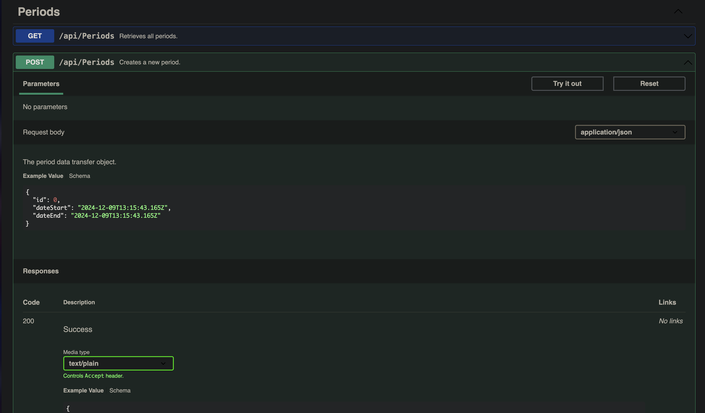
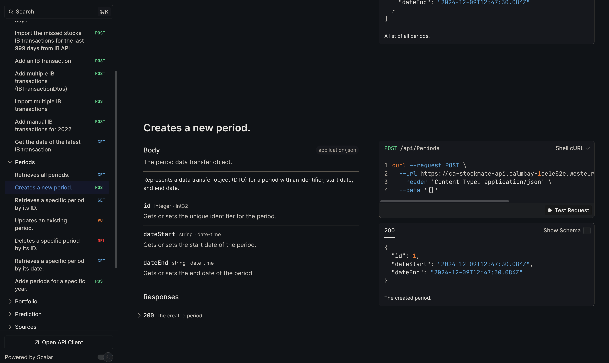

# Web API Conventions and API Documentation

These conventions are strongest for public, customer-facing, partner-facing, and long-lived APIs. Internal service-to-service APIs should follow them for new work where practical, but may document compatibility or migration exceptions when strict REST maturity would create unnecessary churn.

## REST Compliance

Adhere to REST principles (Level 0–2 of Richardson Maturity Model). Level 3 (Hypermedia) is optional.

## REST Methods

Below is a list of methods that Marka REST services SHOULD support. Not all resources will support all methods, but all resources using the methods below MUST conform to their usage.

| Method | Description                                                         | Is Idempotent |
| ------ | ------------------------------------------------------------------- | ------------- |
| GET    | Return the current value of an object                               | True          |
| PUT    | Replace an object, or create a named object, when applicable        | True          |
| DELETE | Delete an object                                                    | True          |
| POST   | Create a new object based on the data provided, or submit a command | False         |
| PATCH  | Apply a partial update to an object                                 | False         |

## Resource Structures

Use nouns, logical URI patterns, and query parameters for filtering/sorting. Avoid verbs in URIs and rely on HTTP methods to represent actions.

**Examples:**

```
GET  /device-management/managed-devices         // Retrieve all devices
POST /device-management/managed-devices         // Create a new device
GET  /device-management/managed-devices/{id}    // Retrieve a single device
```

**Use hyphens (-) to improve the readability of URIs**
To make your URIs easy for people to scan and interpret, use the hyphen (-) character to improve the readability of names in long-path segments.

```
http://api.example.com/api/managed-devices /*correct*/
http://api.example.com/api/manageddevices/ /*incorrect*/
```

**Use lowercase letters in URIs**
When convenient, lowercase letters should be consistently preferred in URI paths.

```
http://api.example.org/api/my-folders/my-doc  /*correct*/
HTTP://API.EXAMPLE.ORG/api/my-folders/my-doc  /*incorrect*/
http://api.example.org/api/My-Folders/my-doc  /*incorrect*/
```

**Use imperative style for endpoint summaries.**
There are two styles of summaries: imperative (e.g. "Create an item") and declarative (e.g. "Creates an item").

"Create an item" (Preferred)

- Imperative style: Reads like a command or instruction to the client.
- Commonly used in documentation as it describes the action the endpoint performs.
- Consistent with how other API specifications (e.g., OpenAPI, REST APIs) are typically written.
- Matches the usual tense of HTTP verbs (e.g., POST, GET):

```
POST /api/items – "Create an item"
GET /api/items – "Get a list of items"
```

Example in OpenAPI specification:

```
"paths": {
  "/items": {
    "post": {
      "summary": "Create an item",
      "description": "Creates a new item in the inventory."
    }
  }
}

```

## Error Handling and Status Codes

- Use RFC 9457 Problem Details (`application/problem+json`) as the error body: `{ type, title, status, detail, instance }` plus extensions `traceId` and `code` (a stable application error code). ASP.NET Core (`AddProblemDetails`) and FastAPI (custom exception handlers) produce this with little code.
- Map standard status codes: 400 (validation), 401, 403, 404, 409, 422, 429, 500.
- Include `traceId` for correlation and troubleshooting.
- Never return internal exception messages or stack traces to clients; log them and return a generic `detail`.
- Existing custom envelopes (for example StaffManagement's `{ statusCode, message, error, traceId }`, ADR-0002 in that repository) are legacy; migrate when the API is next versioned and document the current shape in the API docs until then.

## Pagination, Filtering, and Sorting

- Use `page` and `pageSize` query params (apply sensible defaults and server-side max limits).
- Use `filter[field]=value` and `sort=field,-otherField` conventions.
- Return pagination metadata: `total`, `page`, `pageSize`.

## Idempotency

- For public/customer-facing operations that clients may retry (e.g., create), support the `Idempotency-Key` header to prevent duplicate effects.
- For internal APIs, use `Idempotency-Key` where duplicate effects are plausible and retries cross process or network boundaries; otherwise document the operation's retry behavior.

## Versioning and Deprecation

- Use semantic versioning for APIs. Prefer versioning in the path (e.g., `/v1`) for public APIs; headers are acceptable for internal services.
- Announce public API deprecations with `Deprecation` and `Sunset` headers and documentation; provide migration guidance and timelines.
- For internal APIs, deprecation headers are optional when all consumers are controlled by the same team; still document migration and compatibility expectations.

## Caching and Rate Limiting

- For cacheable public GET endpoints, support `ETag`/`If-None-Match` and appropriate `Cache-Control`; return 304 when unchanged.
- For internal APIs, prefer simple server-side caching and documented cache invalidation semantics unless conditional HTTP caching adds clear value.
- Document rate limits for public or shared APIs. On throttle, return 429 with `Retry-After`.

## Data Formats

- JSON property names use camelCase.
- Timestamps use RFC3339/ISO 8601 in UTC (e.g., `2024-01-02T03:04:05Z`).
- Prefer stable string enums over numeric codes.

---

## API Documentation (Web API, Serverless, Data Contracts)

Document all Web APIs, serverless functions, and data contracts using robust tools. These tools ensure clarity and provide a consistent interface for developers and stakeholders.

- **Preferred Tool**: **Scalar** for its enhanced documentation capabilities and advanced features.
- **Alternative Tool**: **SwaggerUI** for basic API documentation needs (FastAPI's built-in `/docs` counts).
- Register one OpenAPI generator and one UI per host; do not stack Swashbuckle, NSwag, and Scalar in the same application.
- For client SDK and type generation from OpenAPI specs, use **NSwag** (.NET/TS) or **Kiota** (multi-language, Azure/Microsoft aligned).

**SwaggerUI Example**:


**Scalar Example**:


