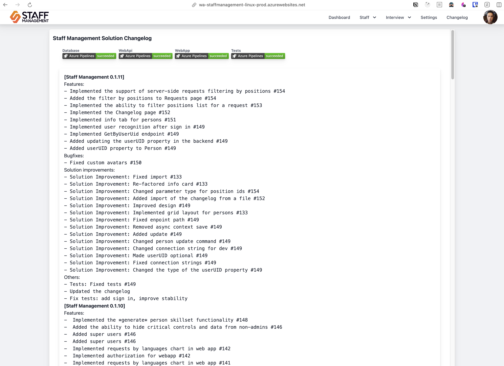
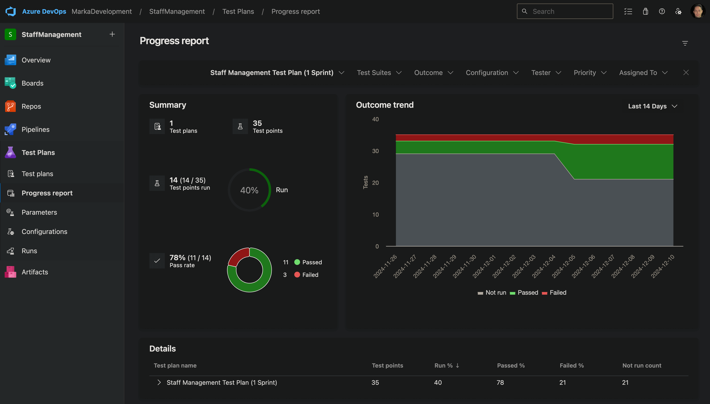
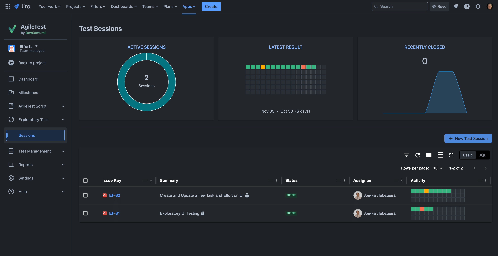
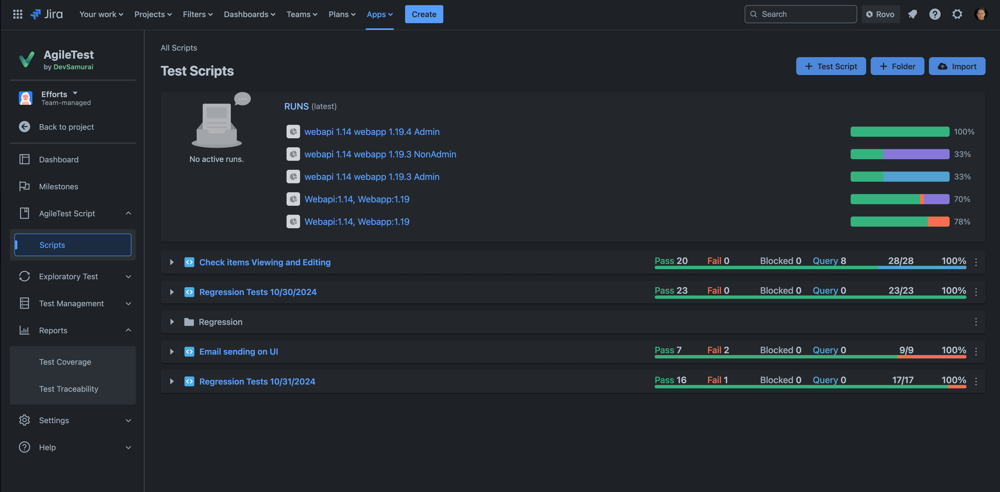
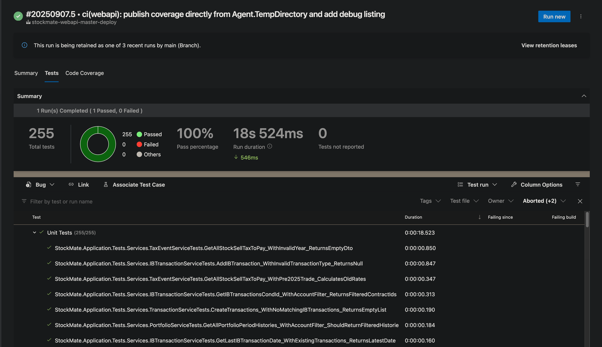
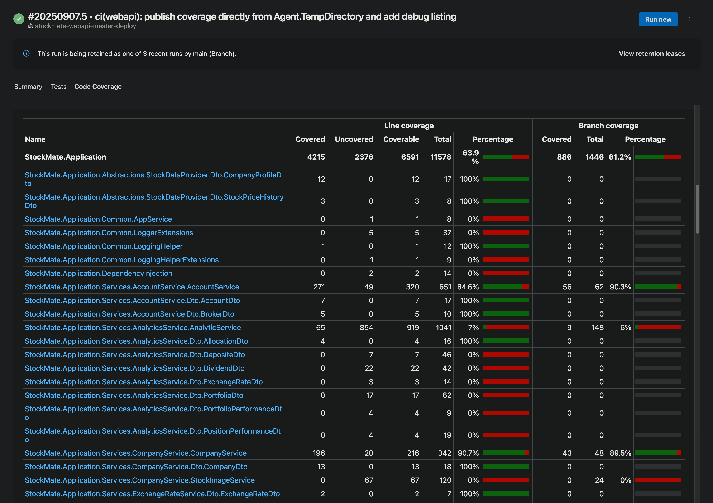
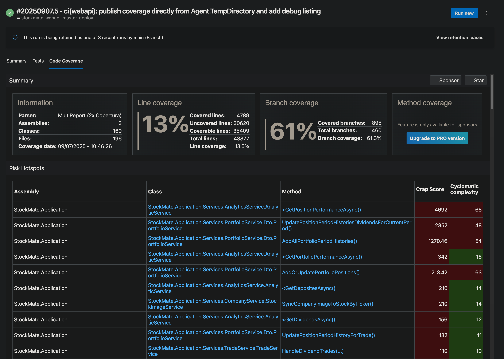

# Delivery: Containers, Cloud, CI/CD, IaC, Backups, and Project Documentation

## Containerization

Deployable services and infrastructure components should be containerized when technically possible. Documentation, libraries, and non-deployable scripts do not need containers, IaC, or monitoring. The containerized solutions should meet the following requirements:

- Flexibility in Deployment:
  - Must be capable of running as a standalone container or as part of a Docker Compose stack.
  - Ready for deployment to any cloud provider as a containerized application.
  - Kubernetes compatibility is required only when Kubernetes is a deployment target.
- Support for Integration Testing:
  - Must be usable in automated testing frameworks, such as Testcontainers, to enable robust and consistent integration testing.
- Standardized Tooling:
  - Docker must be used as the primary tool for containerization to maintain consistency and alignment with industry standards.

### Dockerfile and Docker Compose Requirements

1. Dockerfile

- Every project must include a Dockerfile located in the root directory of the project (one per deployable host in a multi-service solution).
- The base image runtime version must match the version pinned for development (`global.json`, `.python-version`, `mise.toml`).
- The Dockerfile should be:

  - Functional: Able to build and run the containerized application without errors.
  - Efficient: Optimized for performance and image size.
  - Up-to-date: Regularly maintained to reflect the current state of the project.
  - Health-aware and secure: Define a `HEALTHCHECK`; expose only required ports; run as non-root; drop unnecessary capabilities; prefer read-only filesystem where possible.

2. Docker Compose File

- The solution must include a default docker-compose.yml file located in the root directory of the solution.
- The docker-compose.yml file should:
  - Define all the necessary services, networks, and volumes required to run the solution in a containerized environment.
  - Be actual and functional, ensuring all services can be started and interact correctly.
  - Support local development and testing scenarios by including configurations for required dependencies (e.g., databases, message brokers).
  - Include healthcheck for services and least-privilege security options (non-root user, read-only rootfs, dropped capabilities) where possible.

### General Recommendations

- **Use Multi-Stage Builds**  
  Optimize the build process by separating build and runtime stages to reduce the final image size.

- **Prefer minimal hardened base images**  
  Use the smallest maintained base image that is appropriate for the runtime and operational requirements. Alpine is often a good choice for Node.js and Python images; for .NET, prefer Microsoft chiseled/distroless-style runtime images where possible instead of forcing Alpine and its musl/ICU trade-offs.

- **Minimize Image Size and Layer Count**

  - Combine related `RUN` instructions to reduce the number of layers (use `&&` operator).
  - Remove unnecessary files and dependencies to keep the image lean.

- **Use `.dockerignore`**  
  Exclude unnecessary files (e.g., build artifacts, local configurations) from being copied into the image.

- **Harden containers**

  - Run as a non-root user; drop unnecessary Linux capabilities
  - Use a read-only filesystem if possible; mount volumes with least privilege
  - Pin base images by digest when feasible and keep images up to date
  - Expose only required ports and define explicit `HEALTHCHECK`

### Image Optimizations

Leverage tools to analyze and optimize Docker images:

- **[Dive](https://github.com/wagoodman/dive)**  
  A tool for exploring and analyzing Docker images to improve image efficiency and layer usage.

- **[Slim](https://github.com/slimtoolkit/slim?tab=readme-ov-file)**  
  A tool for automatically slimming down Docker images by identifying and removing unnecessary parts.

By following these guidelines, teams can ensure that Docker images are efficient, secure, and optimized for performance.

### Image Tagging and Retention

- Tag images with semantic versions (e.g., `1.2.3`); optionally append a short commit SHA for traceability (e.g., `1.2.3-abcd123`).
- Maintain a clear mapping between application releases and image tags.
- Define image retention policies per environment to prune unreferenced or stale tags regularly.

---

## Project Documentation

### Architecture and ADRs

- Capture key architectural decisions as ADRs under `docs/adr/` (use a template); link to major decisions from the README when relevant.
- Use C4 model diagrams (Context/Container/Component) for core systems; store versioned diagrams under `docs/architecture/`.
- Per-service README: each service repository should document run/test/lint/build/deploy instructions and required environment variables.

### Release Changelogs

Automate the generation of release changelogs using standardized commit messages. This ensures a clear and concise history of changes for each release.

- **Best Practice**: Use tools or custom scripts to parse commit messages formatted in a conventional style (e.g., [Conventional Commits](https://www.conventionalcommits.org/)) to generate changelogs automatically.

**Example Changelog**:
Generated using a custom script based on commit messages.


### Test Reports

Applies to customer projects (Level 3 and above) that owe a release test report to an external stakeholder. Internal and educational projects publish test results in the pipeline only.

Share with stakeholders and customers comprehensive release test reports, that are automatically generated using tools integrated with your DevOps pipeline or based on test runs/executions according to the project test plans and created issues/bugs.
These reports provide a detailed view of test results and coverage (if applicable and required) for every release.

#### Recommended Tools

- **Azure DevOps**: Use built-in test plugins to automatically generate detailed test reports from test executions.
- **Jira**: Leverage Jira test management plugins to integrate with test runs and create comprehensive reports.

**Azure DevOps Test Reports Example**:


**Jira Test Reports Examples**:



---


## Cloud Providers

- **Azure**  
  Azure is the primary and preferred cloud platform, leveraging its robust capabilities and Marka's Microsoft Partner status for seamless integration and support.

- **AWS and GCP**  
  These platforms may be utilized for:
  - Expanding team skill sets in multi-cloud environments.
  - Addressing specific project requirements where Azure may not be the optimal solution.

By prioritizing Azure while remaining open to AWS and GCP, the team ensures adaptability and expertise across multiple cloud platforms.

---

## Azure

### Azure Resources Naming Conventions

Follow these rules to keep Azure resource names consistent and compliant:

- Prefix with resource-type abbreviation
  - Examples: `rg` (resource group), `vnet` (virtual network), `snet` (subnet), `kv` (Key Vault), `sa` (storage account), `acr` (Azure Container Registry), `aca` (Azure Container Apps), `app` (App Service), `appins` (Application Insights), `sql` (SQL server/db), `vm` (virtual machine), `nsg` (network security group), `pip` (public IP), `aks` (AKS), `apim` (API Management).
  - Example: `rg-stockmate`.
- Postfix with environment when separate environments are used
  - Use short env codes: `-dev`, `-stg`, `-prod`.
  - Example: `rg-stockmate-prod`.
- Lowercase only
  - Use only lowercase letters and digits.
- Separators and character limits
  - Use hyphens to separate abbreviation, solution name, and qualifiers where the resource type allows them.
  - For resource types that disallow special characters (e.g., storage accounts, some DNS labels, ACR), use a single concatenated word with no separators.
  - Respect Azure length/character constraints for each resource type.
- Keep names concise and avoid redundancy
  - Don’t repeat the resource type in the descriptive part (e.g., avoid `rg-resourcegroup-stockmate`).
- Tagging for grouping across subscriptions
  - Use Azure tags to group resources by solution and environment, especially in complex projects hosted across multiple subscriptions.
  - Recommended tags: `solution`, `environment` (dev/stg/prod), `owner`, `costCenter` (or `project`), `managedBy`.

Examples:

- Resource Group: `rg-stockmate-prod`
- Virtual Network: `vnet-stockmate-prod`
- Subnet: `snet-stockmate-app-prod`
- Key Vault: `kv-stockmate-prod`
- Storage Account (no separators allowed): `sastockmateprod`
- Container Registry (no separators allowed): `acrstockmateprod`

### Azure Resource Governance

- Use Azure Policy to enforce allowed SKUs/regions, required tags, and security baselines.
- Require tags on all resources: `solution`, `environment`, `owner`, `costCenter` (or `project`), `managedBy`.
- Configure budgets and cost alerts per subscription/resource group.
- Prefer management groups to apply policies and budget guardrails centrally.

---

## DevOps Practices

### Deployment Types

- **Pipeline deployment to Azure Container Apps (default for active projects)**  
  Build the image in Azure DevOps, push to ACR (`marka.azurecr.io`), then `az containerapp update` with the image tag. Images are tagged with the release version and the commit SHA, never only `latest`.

- **Manual Deployment**  
  Manual deployment (`mise run deploy-<target>`) is used for training and short-term projects, and for small projects that have not yet earned a pipeline.

- **Deployment as a docker-compose stack**  
  Deployment as a docker-compose stack to a Marka-managed Portainer instance is used for archived projects, or projects with low activity. In this case, deployments can be made manually or automatically (using a connected repository webhook or a scheduled task).

### CI/CD Pipelines

- Platform: Use Azure DevOps Pipelines as the primary CI/CD platform. GitHub Actions may be used for secondary/training projects.
- Applicability: For long-lasting projects, CI/CD is mandatory. For small and educational projects, the minimum is one validation pipeline (build + unit tests + style gate) on the trunk; deployment may stay manual.
- Ready-made PR validation pipelines (lifted from StaffManagement, the reference implementation) live in [`configs/azure-devops/`](../../configs/azure-devops/README.md): `pr-validate-dotnet.yml`, `pr-validate-webapp.yml`, `pr-conventional-commit-validate.yml`. Copy them into the repository's pipelines folder and register them as build-validation policies on `dev`/`main`.
- Triggers:
  - CI (validation): run on pull requests to `dev` and `main`, and on pushes to feature branches.
  - CD (deployment): run on merges to `dev` and `main` with environment approvals/gates.
- Responsibilities (minimum):
  - Lint and format code (fail on violations; do not auto-commit fixes in CI).
  - Build artifacts and/or container images.
  - Run unit tests; collect and publish test coverage; enforce thresholds where appropriate.
  - Run an informational dependency vulnerability check on every PR (`dotnet list package --vulnerable --include-transitive`, `pnpm audit`); at Level 4, run security and quality scanners as gates (SAST, SCA/dependency & license, container, IaC, secret scanning). Standard: Snyk (Code/Open Source/Container/IaC) with severity gates (fail on high/critical by default). See [Security — Vulnerability and Dependency Management](security.md#vulnerability-and-dependency-management).
  - Publish artifacts (build outputs) and push images to ACR when applicable.
  - Deploy to required environments (dev/stage/prod) using Azure App Service or Azure Container Apps.
- Secrets and configuration:
  - Store secrets in Azure DevOps variable groups and/or Azure Key Vault; never commit secrets.
  - Use service connections for cloud deployments and container registries.
- Environments and approvals:
  - Use Azure DevOps Environments (dev, stage, prod) with checks and approvals; require manual approval for prod.
- Structure and naming:
  - Store YAML pipelines in the repo under `infrastructure/pipelines/` (new repositories) — organized as `pr/`, `dev/`, `prod/`, `maintenance/`. Existing repositories keep their established folder (`Infrastructure/Pipelines/`, `azuredevops/pipelines/`) and record it in `AGENTS.md`; do not leave pipeline YAML at the repository root.
  - Place infrastructure-as-code (IaC) definitions under `infrastructure/terraform/` (or `Infrastructure/Terraform/` in existing repositories) for Terraform; `infrastructure/bicep/` for Bicep.
  - Keep pipelines simple; split when it improves clarity and speed.
  - Centralize common logic in reusable templates under the chosen pipelines folder, for example `infrastructure/pipelines/templates/`.
  - Configuration: use variable groups and consistent service connection names (e.g., `vg-<project>-<env>`, `sc-<target>`).
- Separate/auxiliary pipelines:
  - Test suites: UI, integration, end-to-end, performance/load (on demand, nightly, or on tags/branches). May use ephemeral envs or Testcontainers.
  - Infrastructure: Terraform/Pulumi plan/apply with manual approvals; trigger on infra branches or release tags.
  - Maintenance: backups (DB/storage), Azure Repo backups, cleanup, periodic vulnerability scans (scheduled/cron). See [Orchestration and Scheduled Tasks](#orchestration-and-scheduled-tasks).
- Quality gates:
  - Block merges if CI fails; require checks on PRs.
  - Publish coverage on every run. Enforce thresholds at Level 3 and above (typical baseline ≥ 80% overall, ≥ 90% for critical modules); below that, coverage is a trend to watch, not a gate.
  - Enable secrets scanning (e.g., Gitleaks) on PRs and main.
  - Enforce license policy rules with Snyk Open Source where required by the project.
- Performance:
  - Enable caching for package managers (NuGet/npm/pnpm) and Docker layers.
  - Run jobs and stages in parallel when possible.
- PR validation implementation notes:
  - Use full Git checkout (`fetchDepth: 0` in Azure DevOps) when a check reads commit history, compares revisions, or validates `HEAD~1..HEAD`.
  - Use current pipeline tasks: for Azure DevOps Node setup, prefer `UseNode@1`; do not add new pipelines with deprecated `NodeTool@0`.
  - Keep style gates targeted. If import-ordering is a legacy baseline issue, suppress or filter only import-order diagnostics; keep other formatter/analyzer checks active.

The Conventional Commit check and the C# style gate (with the IMPORTS filter for legacy import ordering) are implemented in [`configs/azure-devops/pr-conventional-commit-validate.yml`](../../configs/azure-devops/pr-conventional-commit-validate.yml) and [`configs/azure-devops/pr-validate-dotnet.yml`](../../configs/azure-devops/pr-validate-dotnet.yml); do not re-implement them inline.

Example Snyk gate for Level 4 pipelines (Azure DevOps YAML using Snyk CLI):

```yaml
# Assumes SNYK_TOKEN is stored securely in a variable group or Key Vault secret
# and mapped into the pipeline as $(SNYK_TOKEN). Do not echo this value.
steps:
  - script: npm install -g snyk
    displayName: Install Snyk CLI

  # Application dependency (SCA) and SAST scans
  - script: |
      snyk test --severity-threshold=high --all-projects
      snyk code test --severity-threshold=high
    displayName: Snyk Code + Open Source scans
    env:
      SNYK_TOKEN: $(SNYK_TOKEN)

  # Infrastructure-as-Code scan (Terraform, K8s, ARM/Bicep, etc.)
  - script: snyk iac test infra/
    displayName: Snyk IaC scan
    env:
      SNYK_TOKEN: $(SNYK_TOKEN)

  # Container image scan (if you build/push an image earlier in the pipeline)
  # Replace $(IMAGE_REF) with the built image reference, e.g. myacr.azurecr.io/app:$(Build.BuildId)
  - script: snyk container test $(IMAGE_REF) --file=Dockerfile
    displayName: Snyk Container scan
    env:
      SNYK_TOKEN: $(SNYK_TOKEN)

  # Optional: continuously monitor the project in Snyk (dashboard & alerts)
  - script: snyk monitor --all-projects
    displayName: Snyk monitor
    env:
      SNYK_TOKEN: $(SNYK_TOKEN)
```

Notes:

- Below Level 4, the baseline is `snyk monitor --all-projects` (from CI or a developer machine) so the project appears in the weekly Snyk report; no gate.
- Prefer the official Snyk Azure DevOps extension for richer PR annotations and results in the UI; use the CLI as a portable fallback.
- Set severity gates via `--severity-threshold` (e.g., high) to fail builds on critical/high issues by default.
- Manage temporary ignores in a `.snyk` policy file with required reason and expiry; review regularly.

#### Example: .NET tests + Cobertura coverage publishing (Azure DevOps)

Collect and publish code coverage in CI. For .NET, use the built-in "XPlat Code Coverage" data collector and publish Cobertura format so Azure DevOps can render coverage summaries.

```yaml
# .NET tests with coverage collection and publishing in Azure DevOps
# Key points:
# - Collect coverage via the built-in "XPlat Code Coverage" data collector
# - Publish Cobertura format so Azure DevOps can render summaries
steps:
  - task: DotNetCoreCLI@2
    displayName: Test (.NET) + collect coverage
    inputs:
      command: test
      projects: '**/*Tests.csproj'
      arguments: >
        -c Release
        -r $(Agent.TempDirectory)/TestResults
        --collect "XPlat Code Coverage"
        --logger "trx;LogFileName=test-results.trx"
      publishTestResults: false

  - script: |
      echo "Listing TestResults:"
      ls -R $(Agent.TempDirectory)/TestResults || true
    displayName: Debug: list test results

  - task: PublishTestResults@2
    displayName: Publish test results (TRX)
    inputs:
      testResultsFormat: VSTest
      testResultsFiles: '$(Agent.TempDirectory)/TestResults/**/*.trx'
      searchFolder: '$(Agent.TempDirectory)/TestResults'
      mergeTestResults: true

  - task: PublishCodeCoverageResults@2
    displayName: Publish code coverage (Cobertura)
    inputs:
      summaryFileLocation: '$(Agent.TempDirectory)/TestResults/**/coverage.cobertura.xml'
      failIfCoverageEmpty: true
```

Sample Azure DevOps visuals for a pipeline test stage:

- Tests tab:



- Code Coverage tab:



- Risk Hotspots panel:



### Code Quality Analysis (SonarQube Community Edition)

Use SonarQube Community Edition (self-hosted on the Marka VM, service connection `sc-sonar-marka-development`) as the static code quality platform for .NET and JavaScript/TypeScript code at Level 4. It detects bugs, code smells, duplicated code, and tracks coverage. Enforce a Quality Gate in CI so changes that lower code health fail early.

Key benefits:

- Continuous visibility into maintainability (complexity, duplication, code smells) and potential bugs
- Clear Quality Gate with pass/fail criteria on new code (coverage, duplicated lines, issues)
- Works on‑prem/self‑hosted; no vendor lock‑in; free Community Edition

Limitations (Community Edition / Community Build):

- Pull Request decoration and `sonar.pullrequest.*` analysis are not available. Run SonarQube on the deploy pipelines (`dev`/`main`) and keep PR validation on build/test/style gates. Record this in an ADR (reference: StaffManagement `docs/adr/0001-backend-pr-sonarqube-validation.md`).

The SonarQube instance runs as a Compose stack in `marka-infrastructure/vm/sonar/`; do not run per-project instances.
Azure DevOps Pipelines integration (using the official SonarQube tasks; the current task major is `@7`):

```yaml
# Requires the "SonarQube" Azure DevOps extension and a service connection
# named sc-sonar-marka-development. No secrets are echoed in logs.
steps:
  - task: SonarQubePrepare@7
    displayName: SonarQube Prepare (.NET)
    inputs:
      SonarQube: "sc-sonar-marka-development" # Service connection name
      scannerMode: "dotnet"
      projectKey: "org_stockmate_app"
      projectName: "StockMate Application"
      extraProperties: |
        sonar.cs.vstest.reportsPaths=$(Agent.TempDirectory)/TestResults/**/*.trx
        sonar.cs.opencover.reportsPaths=$(Agent.TempDirectory)/TestResults/**/coverage.opencover.xml
        sonar.exclusions=**/*.Designer.cs,**/*.g.cs

  # Build + tests + coverage (example for .NET; re-use your project steps)
  # Copy configs/csharp/CodeCoverage.runsettings to the repository root first.
  - task: DotNetCoreCLI@2
    displayName: Test (.NET) + collect coverage
    inputs:
      command: test
      projects: "**/*Tests.csproj"
      arguments: >
        -c Release
        -r $(Agent.TempDirectory)/TestResults
        --collect "XPlat Code Coverage"
        --settings "$(Build.SourcesDirectory)/CodeCoverage.runsettings"
        --logger "trx;LogFileName=test-results.trx"
      publishTestResults: false

  - task: SonarQubeAnalyze@7
    displayName: SonarQube Analyze

  - task: SonarQubePublish@7
    displayName: SonarQube Quality Gate
    inputs:
      pollingTimeoutSec: "300" # wait for server-side analysis and fail build on gate failure
```

JavaScript/TypeScript projects:

- Use the SonarScanner CLI and point to lcov coverage: add `sonar.javascript.lcov.reportPaths=coverage/lcov.info` under `extraProperties`.

SonarQube and Snyk are complementary: SonarQube covers code quality/maintainability and potential bugs; Snyk covers security (SAST), open‑source dependencies and licenses (SCA), container and IaC security. At Level 4 both gate the deploy pipeline.
### Orchestration and Scheduled Tasks

Use scheduled Azure DevOps pipelines (`schedules:` with a cron trigger, `trigger: none`) for maintenance jobs: database and storage backups, dev-database refreshes, cleanup, periodic scans, and multi-step deployments. They live in the `marka-infrastructure` repository under `azuredevops/pipelines/` (reference: `postgresql-backup.yml`, `sql-backup.yml`, `azure-pipelines-stockmate-db-refresh-dev.yml`) or in the project repository's `infrastructure/pipelines/maintenance/`.

- Use a WIF/OIDC service connection scoped to the resource group (e.g. `sc-rg-db`); secrets come from pipeline secret variables.
- Schedules are in UTC; write the local-time equivalent in a comment.
- Dedicated workflow engines (Kestra, n8n) are not part of the standard; existing n8n flows are migrated to pipelines or kept as documented exceptions.

### Infrastructure as Code (IaC)

Terraform is the standard IaC tool (shared platform in `marka-infrastructure`, per-project resources in the project repository). Bicep is acceptable for Azure-only deployments where Terraform adds no value; prefer Bicep over raw ARM.

- Store IaC definitions under `infrastructure/terraform/` (existing repositories keep `Infrastructure/Terraform/`; write the path in `AGENTS.md`).
- Remote state in Azure Blob Storage (`samarka/tfstate`, one key per root module) with state locking. Never commit `terraform.tfstate*`, saved plans (`tfplan`, `*.tfplan`), state backups, or `.terraform/` plugin caches.
- Every root module has a `terraform {}` block with `required_version` and `required_providers` using `~>` constraints; `.terraform.lock.hcl` is committed.
- Gates: `terraform fmt -check -recursive` and `terraform validate` run in CI on every change (this is the `lint` task for IaC repositories).
- Team projects (Level 3 and above): plan on PR, apply from a pipeline with manual approval. Small projects may apply from a developer machine via `mise run tf-apply`, but the plan output is attached to the work item.
- Version-control all IaC; never apply manual infrastructure changes without reflecting them in code. Resources created by CLI during an incident are imported within the week.
- Pipelines and service connections created by Terraform (Azure DevOps provider) are preferred over UI-created ones; use WIF/OIDC service connections (reference: `marka-infrastructure/azuredevops/main.tf`).
- Exported/generated Terraform (`aztfexport`) is acceptable as a starting point; mark it as such in the module README and do not hand-polish it until a real change is needed.
- Self-hosted tools on VMs run as Compose stacks under `vm/<tool>/` in `marka-infrastructure`, with the VM itself and its DNS/TLS in Terraform.

---

## Backup Policy

Implement and enforce a comprehensive backup policy to safeguard data integrity and availability. Regularly scheduled backups, combined with routine restoration testing, ensure that critical resources can be recovered swiftly and reliably in the event of a disaster.

### Objects/Entities to Backup

Ensure the following objects and entities are included in the backup plan:

- **Project Documentation**: All essential project-related documents, plans, and files.
- **Source Code Repositories**: Regularly backup code repositories to protect against accidental deletions or corruption.
- **Infrastructure Code and Configuration Files**: Backup infrastructure as code (IaC) and any configuration files not included in source code repositories.
- **Databases**: Backup databases frequently to avoid data loss and ensure quick recovery.
- **Storage Accounts**: Include both blob and file storage in the backup process.
- **Virtual Machines**: Backup VM instances, including operating systems and application configurations.

### Key Principles

- **Regular Backups**: Back up all critical cloud resources such as databases, storage accounts, and repositories. Follow the project-specific backup policy, including frequency and retention periods.
- **Restoration Testing**: Periodically test the restoration process to verify the integrity and usability of backups. Include restoration drills in the DevOps cycle to simulate disaster recovery scenarios.
- **Infrastructure as Code (IaC)**: Use IaC tools such as Pulumi, Terraform, Azure Bicep, or ARM templates for fast and reliable provisioning of infrastructure. Ensure the IaC scripts are version-controlled and up-to-date.
- **3-2-1 Backup Rule**:
  - Maintain **3 copies** of your data (1 primary and 2 backups).
  - Store backups on **2 different types** of media (e.g., cloud and local storage).
  - Keep **1 copy** off-site for disaster recovery.

### Backup Locations and Security

- **Cloud Backups**: Use Azure Backup, AWS Backup, or GCP Backup to store data securely and leverage automated backup management tools.
- **Local and Off-Site Backups**: For hybrid setups, ensure one copy of the backup is stored locally and another in a geographically distributed location.
- **Secure Storage**: Protect backups with encryption in transit and at rest. Use role-based access control (RBAC) to limit access to backup storage locations.

### Monitoring and Notifications

- **Backup Monitoring**: Implement monitoring for backup success and failure notifications using tools like Azure Monitor, AWS CloudWatch, or custom logging solutions.
- **Alerts**: Set up automated alerts for backup failures or irregularities in the backup schedule to ensure immediate action.

### Policy Guidelines

- **Backup Frequency**: Define a clear schedule for daily, weekly, or monthly backups based on the criticality of the resource.
- **Retention Period**: Determine retention policies for short-term and long-term backups in alignment with legal and business requirements.
- **Backup Scope**: Identify the scope of backups, including databases, file storage, application configurations, and containerized workloads.
- **Scheduling and Orchestration**: scheduled Azure DevOps pipelines (see [Orchestration and Scheduled Tasks](#orchestration-and-scheduled-tasks)). Current implementation: `marka-infrastructure/azuredevops/pipelines/postgresql-backup.yml` and `sql-backup.yml` run on weekdays at 18:00 UTC and upload dumps to `samarka/backups` with a 14-day lifecycle rule (`azuredevops/lifecycle.tf`). The pipeline README documents restore procedures; completed restore drills must be logged there.

#### Recommended Tools

- **Azure**: [Azure Backup](https://azure.microsoft.com/en-us/products/backup/), Azure Site Recovery for disaster recovery.
- **AWS**: [AWS Backup](https://aws.amazon.com/backup/), S3 lifecycle policies.
- **GCP**: [Google Cloud Backup and DR](https://cloud.google.com/backup-and-dr), Persistent Disk snapshots.
- **On-Premise**: Tools like Veeam, Bacula, or rsync for local and hybrid backup solutions.

By adhering to these guidelines, projects will achieve robust data protection, ensure high availability, and align with organizational and regulatory requirements for disaster recovery.

