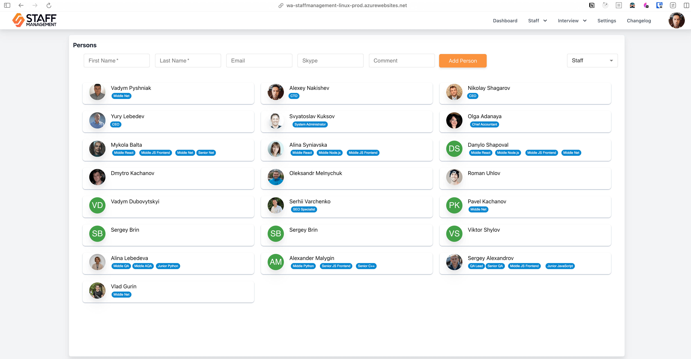
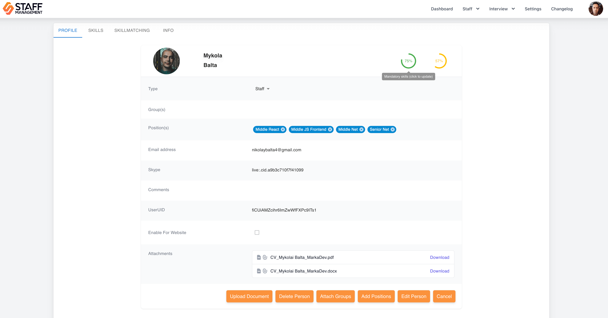
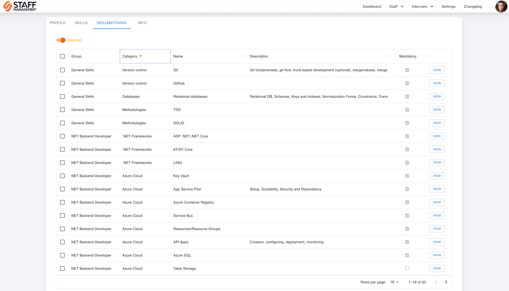
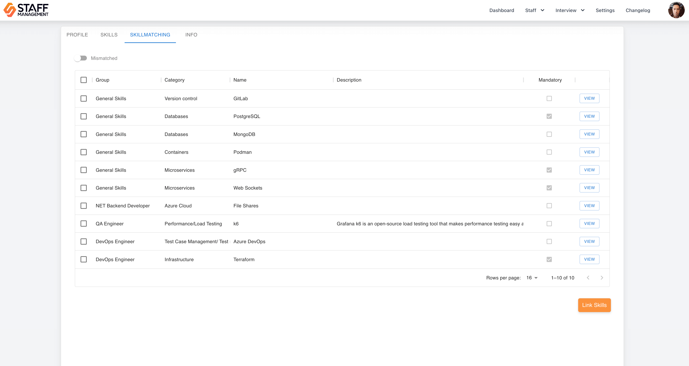
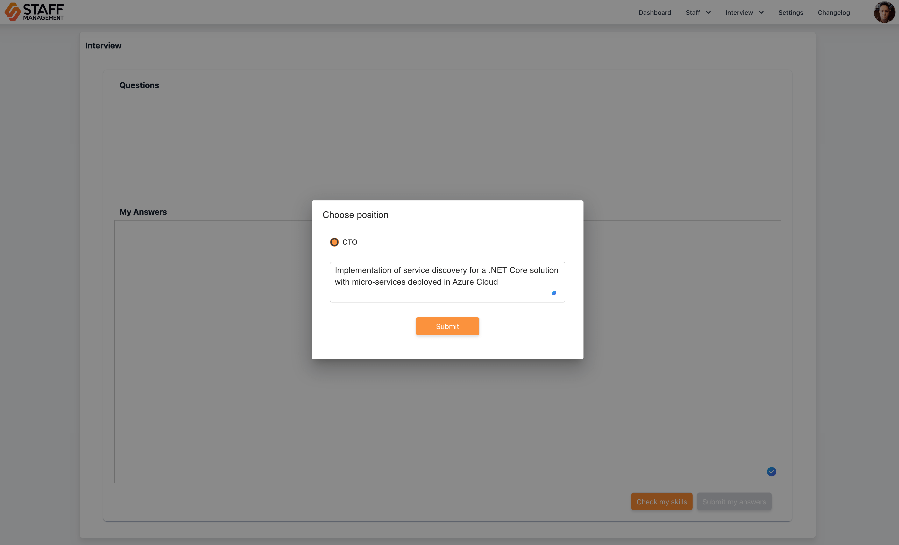

# Human Resources

## Tools

Marka employs a custom “Staff Management” solution for handling HR-related processes, including candidate management, employee skill assessments, and professional development tracking. This system streamlines HR operations, improving efficiency and automation.

**Access:** [Staff Management System](https://wa-staffmanagement-linux-prod.azurewebsites.net)  
Obtain credentials from Marka’s CTO.

## Onboarding

When onboarding a new employee, the following steps must be taken:

- Create an Entra ID (Azure AD) account in the `marka-software.company` domain.
- Set up a Staff Management System account.
- Create a Kimai time-tracking account (with project and customer configuration if required).
- Conduct an introductory call and provide all necessary credentials and accesses.

Post-onboarding, essential information (contacts, benefits, process standards, tools, licenses) is available under the user’s personal tab in the Staff Management System.

## Qualification Monitoring and Training

The Staff Management System automatically tracks both required and current qualifications for each employee, ensuring alignment with professional standards. Regular Personal Development Plans (PDPs) and feedback sessions facilitate continuous growth and relevance in the market.

## Monitoring and Skill Assessment

- **Interns and Juniors**: Skill checks to be conducted in Staff Management System every two weeks.
- **Other Roles**: Assessment schedules are determined individually.

The system calculates a **skill score** for each employee, divided into two categories:

1. **Mandatory Qualifications**: Required for the employee's position.
2. **Optional Qualifications**: Additional skills that enhance the employee’s role.

Skill scores are derived from the number of skills linked to the employee via completed tasks or automatic skill checks (internal interviews). Current scores are displayed on the employee's personal page in the Staff Management System.

## Skill Score Requirements

- **Mandatory Qualifications**: A minimum score of **70%** is required for qualification.
- **Optional Qualifications**: A minimum score of **50%** is required for qualification.

## Viewing Skills

To review linked skills:

1. Open the `Skillmatching` tab on the employee's personal page.
2. Toggle to `Matched` to view skills already obtained and proved.

Skills that still need to be acquired appear under the `Mismatched` toggle.

## Conducting Skill Checks and Interviews

To initiate a new skill check or interview:

1. Navigate to `Interview -> New Interview`.
2. Click **Check My Skills**.
3. Select a position for skill assessment.
4. Complete the proposed questions and submit the results.

For targeted skill improvement, employees can add a specific topic under the selected position before starting the interview.

## Viewing Interview Results

Results from completed interviews can be accessed under `Interview -> History` in the Staff Management System.

---

