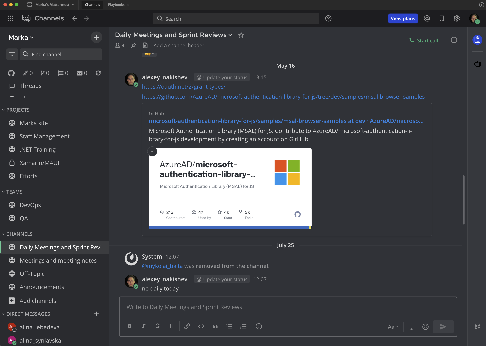
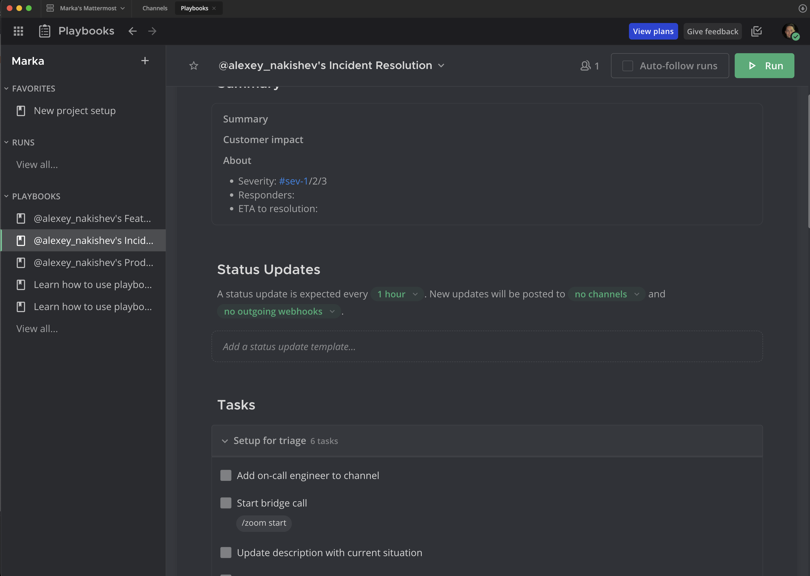
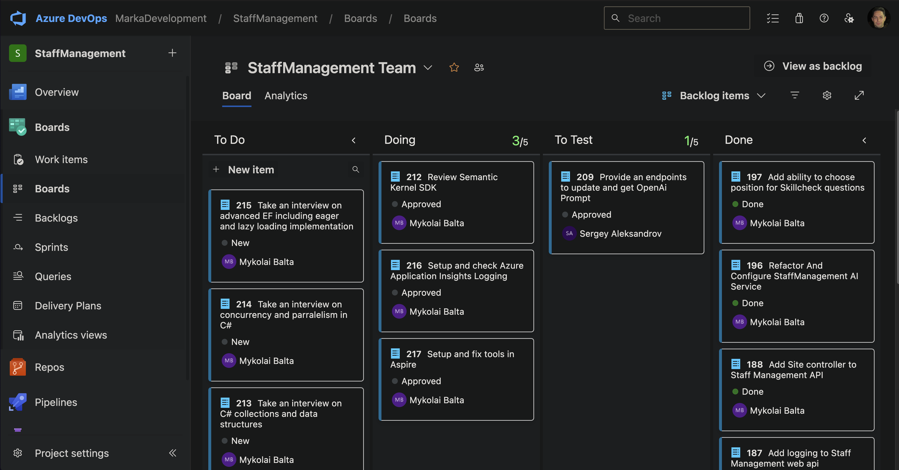

# Workflow: Collaboration, Planning, Git, Code Style, and Reviews

## Communication and Process Workflows

For internal and managed projects, all corporate communication should occur via Marka’s self-hosted Mattermost solution. Microsoft Teams may be used instead if the team prefers it and there are no strict requirements to self-host project communications or avoid 3rd-party apps. Document the chosen tool in project documentation and ensure it aligns with customer requirements.



For critical project workflows, configure and use automated playbooks within Mattermost, such as those for incident resolution:



## Project Management Tools and Resources

Azure DevOps Projects is the default choice for project management. Jira and Confluence may be used as secondary or training platforms. Marka’s Azure and Atlassian subscriptions must be used exclusively for company projects and staff skill development.

## Default Project Model and Team Activities

The standard project methodology for team projects (Level 2 and above) is Scrum with two-week sprints.
Stand-ups (daily recommended, minimum twice a week), sprint planning, and sprint reviews are recommended. Sprint reviews can be conducted on demand.



Small and educational projects (see [Small and Educational Projects](../../README.md#small-and-educational-projects)) do not run sprints. Work is planned as Azure DevOps work items plus execution plans in the repository (see [Planning and Execution Plans](#planning-and-execution-plans)); commits and PR titles reference the work item (`#123`).

## Planning and Execution Plans

Every repository keeps its implementation planning in the repository, next to the code, so that humans and AI agents share one source of truth:

- `docs/exec-plans/active/` — plans for work in progress. An agent or developer creates or updates a plan here before non-trivial implementation starts.
- `docs/exec-plans/completed/` — plans moved here once implementation is done and the durable docs (README, ARCHITECTURE, ADRs) are updated. Never leave completed plans in `active/`.
- `docs/exec-plans/deferred/` — plans consciously postponed, with the reason and the trigger that would reactivate them.
- `docs/exec-plans/tech-debt-tracker.md` — recurring cleanup themes that deserve planning but are not yet a plan.
- `docs/adr/` — Architecture Decision Records for decisions that are hard to reverse, surprising without context, or a real trade-off. Use `NNNN-short-title.md` with Status / Context / Decision / Consequences.

A plan is a short markdown file with: goal, scope, files to change, test strategy, verification commands, rollout steps. Keep it to one screen where possible.

Record a disabled or weakened quality gate as an ADR, not as a silent pipeline edit. Example: StaffManagement `docs/adr/0001-backend-pr-sonarqube-validation.md` explains why SonarQube runs on deploy but not on PRs. This is the standard way to "document deviations" required by [Applicability and Exceptions](../../README.md#applicability-and-exceptions).

## Task Runner (mise)

Use [`mise`](https://mise.jdx.dev/) as the toolchain pinner and task runner in every repository. It replaces ad-hoc shell instructions in READMEs and gives agents one entry point (`mise tasks`, `mise run <task>`).

- `mise.toml` — pinned tools (`dotnet`, `node`, `pnpm`, `python`, `terraform`, …) and tasks. Committed.
- `mise.<env>.toml` — per-environment non-secret settings (optional). Committed.
- `mise.local.toml` — developer-local settings and secrets. Gitignored. Never commit.

Canonical task names (use these names so any agent or developer can run them in any repo; add project-specific tasks alongside):

| Task | Meaning |
| --- | --- |
| `dev` | Run the application locally with dependencies |
| `build` | Build all deliverables |
| `lint` | Lint + format check (no writes) |
| `lint-fix` | Lint + format with writes |
| `typecheck` | Static type check where applicable (`tsc`, `ty`) |
| `test` | Unit tests |
| `test-integration` | Integration tests (Testcontainers/Docker required) |
| `verify` | Everything CI runs, in order: build, lint, typecheck, tests. Must pass before a push to a shared branch |
| `docker-build` / `docker-up` / `docker-down` | Container lifecycle |
| `migration-*` | Database migration tasks (`migration-add-dev`, `migration-apply-dev`, `migration-apply-prod`, …) |
| `deploy-<target>` | Manual deployment tasks (small projects only; team projects deploy from CI) |

See [`configs/mise/mise.toml`](../../configs/mise/mise.toml) for a starter file.

---

## Version Control and Branching

Use Git for all projects, with Azure DevOps Repos or GitHub for repository hosting.

### Team projects (Level 2 and above)

Adopt Git Flow for large projects, or the simplified model:

- **main:** fully tested, production-ready code
- **dev:** active development branch
- **feature/**: feature branches for changes that go through a PR
- **bugfix/**, **hotfix/**, **docs/**: as needed

Existing repositories that use `master`/`develop` keep those names; do not rename mature repositories for naming alone. Write the actual branch names and the merge strategy in the repository `AGENTS.md`.

### Small and educational projects

Trunk-based development is acceptable: commit directly to `main` (or `master`), optionally with short-lived branches for larger changes. Requirements that still apply:

- Conventional Commits with a work item reference where one exists.
- `mise run verify` passes before every push to the trunk.
- Tag releases (see below) so that a deployed image can be traced to a commit.

### Tags

Tag releases in `main` (or `master` for legacy repos) with semantic version numbers. Tag examples:

- v1.0.0
- v1.0.1

Do not use tags for backups (`backup-*`); use a branch or a Git bundle instead so the tag list stays a release list.

### Branch naming

- Use lowercase letters and hyphens to separate words (kebab-case)
- Include a category prefix like feature/, bugfix/, hotfix/, or docs/
- Keep names descriptive but concise
- Incorporate issue or ticket numbers when applicable
- Avoid using only numbers
- Use clear, meaningful names that explain the branch's purpose

In projects with extreme level of collaboration, it is acceptable to put developer initials in the branch name.
Typical format in this case: [category]/[initials]/[work_item_id]/[description]

Examples:

- feature/jd/#123/user-login
- bugfix/mp/#124/database-connection

## Technology Stack and Tooling Approval

- Customer alignment: Project technology stack (languages, frameworks, databases, cloud services) must be agreed with the customer and approved by the Tech Lead/Architect/Team Lead.
- Internal tools and services: Any new 3rd-party development tool/service to be used within Marka’s infrastructure must be pre-approved by the CTO and an infrastructure engineer/admin, and must comply with company security, licensing, and data-protection policies.
- Network resources: Opening ports, changing firewall rules, VNet/VPN changes, exposing public endpoints, or provisioning additional networked resources require prior approval by the CTO + infrastructure engineer/admin. Include purpose, ports/protocols, environment/scope, duration, and owner in the request.
- Documentation: Record approved stacks and tools in the repository (README or ADRs in docs/adr/) and keep them up to date. Prefer using already-approved, standard tools when possible.
- Safety first: Trial new tools in non-production/sandbox environments; do not store customer data during evaluations; remove unused tooling/services after trials.

## Code Style and Formatting

Maintain high-quality, consistent, and maintainable code by establishing corporate code standards and enforcing them via dedicated tasks in CI/CD pipelines (preferred) or local git hooks (optional).

### IDE/Editor Configuration

Use `.editorconfig` (https://github.com/editorconfig) or other standardized configuration files for consistent formatting and styling.
Find pre-configured `.editorconfig` files for C#, JavaScript/TypeScript, Python, and Terraform in the repository under [`configs/`](../../configs/README.md).

### Linters and Formatters

Employ linters and formatters to enforce code style rules automatically.

- C#: `.editorconfig` is the formatting source of truth; `dotnet format` is the formatter; Roslyn/StyleCop analyzers are the linter. Marka is moving all C# projects to `dotnet format` because it respects `.editorconfig`. Do **not** use CSharpier; it is retired for Marka projects. Remove any `.csharpierrc*` from repositories that still carry one. Enable `TreatWarningsAsErrors` in CI for projects that have completed analyzer baselining. Use `dotnet format <sln> --verify-no-changes --severity warn --no-restore` as the CI style gate where practical. If a legacy codebase has noisy import ordering, ignore only the `IMPORTS` diagnostic in the pipeline wrapper; do not remove the whole style/analyzer gate. Details: [.NET conventions](dotnet.md).
- JavaScript/TypeScript: Use `Biome` as both linter and formatter. See [`configs/javascript-typescript/biome.json`](../../configs/javascript-typescript/biome.json) for the Marka base config. Details: [Web Frontend](web-frontend.md).
- Python: Use `ruff` as both linter and formatter, `ty` (or `pyright`) for type checks. Details: [Python conventions](python.md).
- Terraform: `terraform fmt -check -recursive` and `terraform validate`. Details: [Delivery — IaC](delivery.md#infrastructure-as-code-iac).

### Commit Message Validation

- All projects must follow Conventional Commits for clarity and automated changelogs.
- Preferred enforcement point: CI/PR validation with `commitlint`. Local hooks are optional; do not require Husky in projects where CI gates already block invalid messages.
- JavaScript/TypeScript projects: Use `@commitlint/cli` + `@commitlint/config-conventional`; use the Marka config in [`configs/javascript-typescript/commitlint.config.js`](../../configs/javascript-typescript/commitlint.config.js). The base config enforces type/scope/subject basics but intentionally does not fail on subject capitalization or long PR/squash body lines.
- C# and Python projects: enforce commit message rules via the CI pipeline. Use the ready-made Azure DevOps pipeline [`configs/azure-devops/pr-conventional-commit-validate.yml`](../../configs/azure-devops/pr-conventional-commit-validate.yml); it validates the PR title (or the source commit when the title is unavailable) and requires a work item reference (`#123`).
- For Azure DevOps PR validation, use `checkout: self` with `fetchDepth: 0` before any `commitlint --from=HEAD~1 --to=HEAD` fallback. Prefer `UseNode@1` for Node setup; `NodeTool@0` is deprecated.
- Small projects without PRs: keep the same message format; validation is the author's responsibility (`commitlint` via an optional local hook is the cheapest way).

### Commit Message Standards

Commit messages should be clear and descriptive, including:

- Change type — one of `feat`, `fix`, `refactor`, `perf`, `test`, `docs`, `style`, `build`, `ci`, `chore`, `revert` (not `feature:` or `bugfix:`)
- Optional scope in parentheses: `feat(api): …`
- Brief summary in one line (≤ 100 characters). Do not concatenate several messages into one subject line; put details in the body.
- Task/issue number
- Optional detailed lists of changes and rationale in the body

**Example:**

```
feat: Enhance portfolio period aggregation #1287

Extended IPortfolioService and PortfolioService for optional filtering of portfolio period histories.
Modified PortfolioController to accept a currentPeriodOnly query parameter.
Improved UpdateCurrentPrices logic for recalculation after price updates.
These enhancements increase flexibility and usability of the portfolio period aggregation feature.
```

---

## Code Review and Pull Requests

Code reviews help us ship fast without breaking quality. Keep it simple, respectful, and pragmatic.

Pull requests are mandatory for team projects (Level 2 and above). Small and educational projects with a single developer may commit to the trunk directly; they should still run an AI PR review (Marka Agents or an agent skill) before deploying user-facing changes.

### Creating a Pull Request

- Base against the correct branch: `dev` for staging, `main` for production releases (see Version Control and Branching).
- Keep PRs small and focused. As a rule of thumb, prefer ≤ 400 changed lines (excluding generated files). Split big work into incremental PRs.
- Title uses Conventional Commits style: `feat: short summary #123`; include the work item/issue number when applicable.
- Description includes:
  - What changed and why (context/problem statement and approach)
  - How it was implemented (key design decisions)
  - Testing done (how to reproduce, test cases, environments)
  - Screenshots/GIFs for UI changes, test results
  - Backward compatibility, migrations, rollout/rollback plan if relevant
  - List of required settings and environment variables (e.g., appsettings.json, Key Vault secrets), specifying what settings to be added or modified with concrete values (if possible)
  - Required changes to the infrastructure (e.g., Azure resources, VNet/VPN, firewalls, docker images etc.)
  - Readme, docs, contracts, API changes if relevant
- Mark as Draft if work is in progress or awaiting dependencies.
- PR checklist (author verifies before requesting review):
  - Formatting and linters applied; no new warnings (C#: treat warnings as errors; JS: linter clean)
  - If the PR changes business logic, include unit tests covering the implemented/modified behavior; update existing tests as needed (explain any exceptions in the description)
  - If the PR changes transport layer/infrastructure (e.g., API contracts, database schema, docker images), include integration tests covering the implemented/modified behavior; update existing tests as needed (explain any exceptions in the description)
  - All tests pass locally (`mise run verify`); new/updated tests added where it makes sense
  - Docs updated (API/Contracts/README) if behavior or interfaces changed
  - Changelog/version updated when user-facing behavior changes
  - No secrets/credentials in code, config, or diffs; use env/Key Vault instead
  - Container image builds locally (if applicable)
  - Observability updated if relevant: structured logging, metrics, tracing, and wide event context fields where applicable

### Review Process

- Approvals: at least 1 reviewer for normal changes; 2 for risky/production-impacting changes (migrations, auth, security, perf-sensitive paths).
- Use CODEOWNERS or repository reviewer rules when available (GitHub/Azure DevOps both supported).
- Turnaround: aim to start review within 1-2 business days. Authors should respond within 1 business day.
- AI review (Marka Agents PR review workflow) is an additional signal, not a replacement for the human reviewer. See [AI/LLM in Development](ai-development.md).
- Author responsibilities:
  - Self-review before requesting review; run the full local/CI checks
  - Address every comment (code change or a reply) and resolve conversations when done
  - Avoid force-push/rebase after reviews begin unless necessary; communicate if you must
- Reviewer responsibilities:
  - Be specific, kind, and solution-oriented; prefer suggested edits for nits
  - Focus on correctness, design, security/privacy, performance, tests, and consistency with our standards
  - Approve when ready; use “Request changes” for blocking issues; use comments for non-blocking suggestions

### Merging

- All required CI checks must be green (build, tests, linters; security/dependency scans when configured). Use the PR validation pipelines in [`configs/azure-devops/`](../../configs/azure-devops/README.md) as the baseline.
- Prefer Squash & Merge to keep history clean. Use the PR title as the commit message (Conventional Commits), and include the PR/issue number. Azure DevOps "Merge (no fast-forward)" is acceptable when the repository has always used it; write the choice in `AGENTS.md` and do not mix strategies.
- Delete the feature branch after merge.
- When merging to `main` (or `master`), tag releases and follow the Versioning guidance.
- For risky changes (migrations, infra): agree on rollout and rollback, and monitor after deployment.

---

## Automated Dependency Updates

- Lock files are committed for every ecosystem (`pnpm-lock.yaml`, `uv.lock`, `.terraform.lock.hcl`, and NuGet `packages.lock.json` where central package management is enabled).
- .NET: use central package management (`Directory.Packages.props`) so one version per package exists per repository. See [.NET conventions](dotnet.md).
- Run an informational vulnerability check in every PR pipeline (`dotnet list package --vulnerable --include-transitive`, `pnpm audit`, `uv run pip-audit`); turn it into a gate at Level 4.
- Teams may adopt Renovate where it makes sense for the project. Configure Renovate to create automated pull requests for dependency updates and integrate it into your CI/CD pipelines and PR review flow (scheduling, grouping, and rules can be tailored per repository or via shared presets). See https://docs.renovatebot.com/ for setup and configuration details.

## Repository Hygiene

- The repository root contains only build, tooling, and documentation files. Scratch files, screenshots, exported logs, ad-hoc SQL, and IDE user files (`*.DotSettings.user`, `.idea/`) do not belong in git.
- Keep a gitignored `.tmp/` for local scratch work.
- Generated artifacts (`obj/`, `bin/`, `node_modules/`, `.terraform/`, saved plans (`tfplan`, `*.tfplan`), state backups, `__pycache__/`, cache files) are never committed. Start from the [`configs/`](../../configs/README.md) `.gitignore` templates.
- Commit work at least daily on active projects; long-lived uncommitted changes are lost work waiting to happen.
